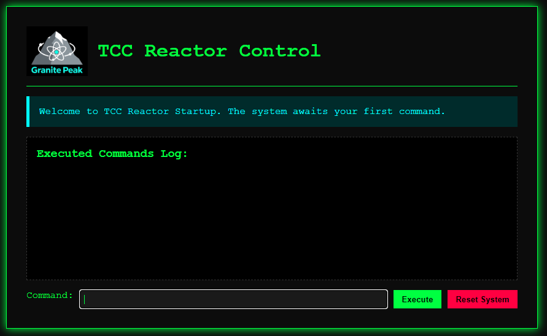

# Zadanie

Hi, trainee,

normally, this task would be assigned to a senior worker, but none are available now, so your mission will be to start the shut-down reactor at the Granite Peak Nuclear as quickly as possible — by following the startup checklist and entering the sequence step by step. However, we have a big problem: the standard items (e.g., "primary circuit leak test") have somehow been renamed to nonsense by some cat-holic. Only the first item, `Initiate Control Circuits`, and the last one, `Phase the Power Plant`, remain unchanged.

The radiation situation at Granite Peak Nuclear remains normal.

Stay grounded!

Interface for starting sequence is at [http://gpn.powergrid.tcc/](http://gpn.powergrid.tcc/)

**Hints**

- All services in powergrid.tcc domain are accessible via VPN only.
- Don’t worry, the reactor has built-in safeguards, so in case of an incorrect sequence it will automatically shut down again.
- Some simple automation with a script would be quite handy (doing it manually is feasible, but would be a gargantuan task).

## Riešenie

Po príchode na stránku sa nám zobrazí akási konzola.



Zo zadania vieme prvý a posledný príkaz, ktorý máme zadať. 

Po zadaní prvého - `Initiate Control Circuits` nám konzola odpovie `Command accepted. Sequence valid so far. Enter the next one.` 

Ďalší nevieme, ale zadám posledný `Phase the Power Plant` a konzola odpovie `Error: Invalid sequence. Item 'Deploy Whisker Sensor Array' missing. System reset.` 

Vieme teda, že ktorý nám chýba a zrejme ich takých bude viac. Ako hovorí hint, je lepšie to zautomatizovať.

```python
import requests, re, time, urllib.parse
from bs4 import BeautifulSoup

URL = 'http://gpn.powergrid.tcc/'
START, FINISH = "Initiate Control Circuits", "Phase the Power Plant"
HDRS = {
    'User-Agent': 'Mozilla/5.0',
    'Referer': URL,
    'Origin': URL.rstrip('/'),
    'Content-Type': 'application/x-www-form-urlencoded',
    'Accept': 'text/html,application/xhtml+xml,application/xml;q=0.9,*/*;q=0.8',
}

def text_only(html: str) -> str:
    return BeautifulSoup(html, 'html.parser').get_text(" ", strip=True)

def find_flags(html: str):
    return re.findall(r'FLAG\{[^}]*\}', text_only(html), flags=re.IGNORECASE)

def find_missing(html: str):
    m = re.search(r"Item\s*'([^']+)'\s*missing", text_only(html), flags=re.IGNORECASE)
    return m.group(1) if m else None

def adopt_php_session(session: requests.Session, resp: requests.Response):
    new_sid = None
    if 'PHPSESSID' in resp.cookies:
        new_sid = resp.cookies.get('PHPSESSID')
    else:
        sc = resp.headers.get('Set-Cookie')
        if sc:
            m = re.search(r'PHPSESSID=([^;]+)', sc)
            if m: new_sid = m.group(1)
    if new_sid:
        old = session.cookies.get('PHPSESSID')
        if old != new_sid:
            session.cookies.clear()
            session.cookies.set('PHPSESSID', new_sid)
            print(f"🍪 PHPSESSID: {old} → {new_sid}")

def first_get(session: requests.Session):
    resp = session.get(URL, headers=HDRS, verify=False, allow_redirects=False, timeout=15)
    adopt_php_session(session, resp)

def post_then_follow_one(session: requests.Session, command: str) -> str:
    print(f">> {command}")
    resp = session.post(URL, headers=HDRS, data={'command': command},
                        verify=False, allow_redirects=False, timeout=15)
    adopt_php_session(session, resp)

    if resp.status_code == 302:
        loc = urllib.parse.urljoin(URL, resp.headers.get('Location', '/'))
        getr = session.get(loc, headers=HDRS, verify=False, allow_redirects=False, timeout=15)
        adopt_php_session(session, getr)
        html = getr.text
    else:
        html = resp.text

    for f in find_flags(html):
        print(f"\n\nFlag found: {f}\n")
    return html

def solve():
    session = requests.Session()
    first_get(session)

    seq = [START]
    while True:
        full = seq + [FINISH]
        print("\n=== Running sequence ===")
        for i, cmd in enumerate(full, 1):
            print(f"[{i}/{len(full)}] ", end="")
            html = post_then_follow_one(session, cmd)
            time.sleep(0.05)

        miss = find_missing(html)
        if miss:
            print(f"Missing command: {miss} → adding before very last")
            seq.append(miss)
            continue

        print("\nFinal sequence:")
        for i, cmd in enumerate(full, 1):
            print(f"[{i}] {cmd}")
        break

if __name__ == "__main__":
    solve()
```

Koniec výstupu z konzoly

```log
...

=== Running sequence ===
[1/22] >> Initiate Control Circuits
[2/22] >> Deploy Whisker Sensor Array
[3/22] >> Initiate Cuddle-Heat Exchanger
[4/22] >> Prime Catnap Capacitor Bank
[5/22] >> Prime Yarn-Ball Cooling Fans
[6/22] >> Calibrate Scratch-Post Stabilizer
[7/22] >> Enable Laser Pointer Control Panel
[8/22] >> Trigger Kibble Fuel Injector
[9/22] >> Ignite Catnip Combustion Chamber
[10/22] >> Initiate Snuggle Containment Field
[11/22] >> Mobilize Paw-Kneading Rhythm Generator
[12/22] >> Enable Fur-Static Charge Collector
[13/22] >> Calibrate Milk Valve Regulator
[14/22] >> Enable Cuddle-Grid Synchronizer
[15/22] >> Deploy Nap-Time Auto-Shutdown Relay
[16/22] >> Trigger Paw-Print Main Breaker
[17/22] >> Deploy Grooming Station
[18/22] >> Initiate Meow Frequency Modulator
[19/22] >> Tune Purr Resonance Chamber
[20/22] >> Engage Harmony Purr Amplifier
[21/22] >> Prime Purr Frequency Equalizer
[22/22] >> Phase the Power Plant
Missing command: Check Purr-to-Volt Converter Coils → adding before very last

=== Running sequence ===
[1/23] >> Initiate Control Circuits
[2/23] >> Deploy Whisker Sensor Array
[3/23] >> Initiate Cuddle-Heat Exchanger
[4/23] >> Prime Catnap Capacitor Bank
[5/23] >> Prime Yarn-Ball Cooling Fans
[6/23] >> Calibrate Scratch-Post Stabilizer
[7/23] >> Enable Laser Pointer Control Panel
[8/23] >> Trigger Kibble Fuel Injector
[9/23] >> Ignite Catnip Combustion Chamber
[10/23] >> Initiate Snuggle Containment Field
[11/23] >> Mobilize Paw-Kneading Rhythm Generator
[12/23] >> Enable Fur-Static Charge Collector
[13/23] >> Calibrate Milk Valve Regulator
[14/23] >> Enable Cuddle-Grid Synchronizer
[15/23] >> Deploy Nap-Time Auto-Shutdown Relay
[16/23] >> Trigger Paw-Print Main Breaker
[17/23] >> Deploy Grooming Station
[18/23] >> Initiate Meow Frequency Modulator
[19/23] >> Tune Purr Resonance Chamber
[20/23] >> Engage Harmony Purr Amplifier
[21/23] >> Prime Purr Frequency Equalizer
[22/23] >> Check Purr-to-Volt Converter Coils
[23/23] >> Phase the Power Plant


Flag found: FLAG{WuYg-ynFt-US0N-ZYv9}


Final sequence:
[1] Initiate Control Circuits
[2] Deploy Whisker Sensor Array
[3] Initiate Cuddle-Heat Exchanger
[4] Prime Catnap Capacitor Bank
[5] Prime Yarn-Ball Cooling Fans
[6] Calibrate Scratch-Post Stabilizer
[7] Enable Laser Pointer Control Panel
[8] Trigger Kibble Fuel Injector
[9] Ignite Catnip Combustion Chamber
[10] Initiate Snuggle Containment Field
[11] Mobilize Paw-Kneading Rhythm Generator
[12] Enable Fur-Static Charge Collector
[13] Calibrate Milk Valve Regulator
[14] Enable Cuddle-Grid Synchronizer
[15] Deploy Nap-Time Auto-Shutdown Relay
[16] Trigger Paw-Print Main Breaker
[17] Deploy Grooming Station
[18] Initiate Meow Frequency Modulator
[19] Tune Purr Resonance Chamber
[20] Engage Harmony Purr Amplifier
[21] Prime Purr Frequency Equalizer
[22] Check Purr-to-Volt Converter Coils
[23] Phase the Power Plant
```

## Vlajka

    FLAG{WuYg-ynFt-US0N-ZYv9}
