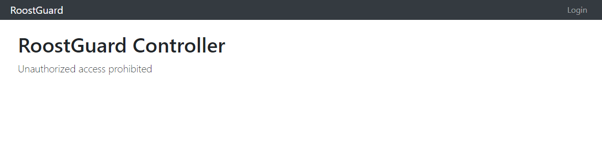
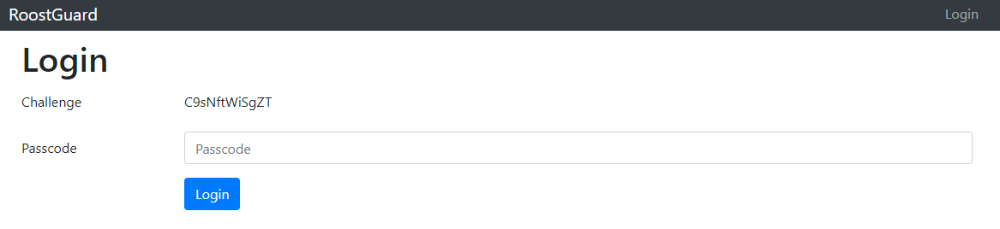
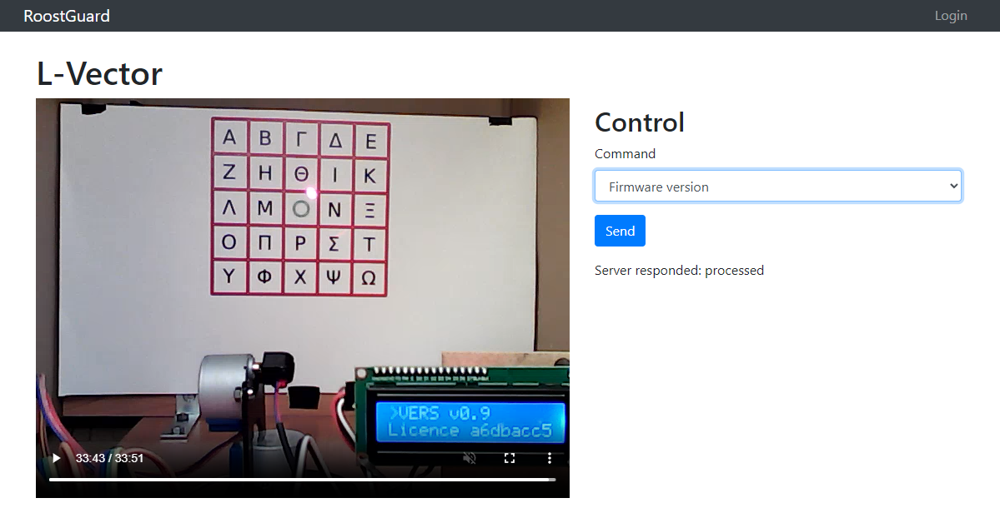

# Zadanie

Hi, emergency troubleshooter,

recent studies suggest that the intense heat and hard labor of solar technicians often trigger strange, vivid dreams about the future of energetics. Over the past few days, technicians have woken up night after night with the same terrifying screams "Look, up in the sky! It’s a bird! It’s a plane! It’s Superman! Let’s roast it anyway!".

Find out what’s going on, we need our technicians to stay sane.

Stay grounded!

- [http://intro.falcon.powergrid.tcc/](http://intro.falcon.powergrid.tcc/)

**Hints**

- Be sure you enter flag for correct chapter.
- In this realm, challenges should be conquered in a precise order, and to triumph over some, you'll need artifacts acquired from others - a unique twist that defies the norms of typical CTF challenges.
- Chapter haiku will lead you.

## Riešenie

Haiku pri tejto úlohe znie

```
1 Operator

Soft winds gently blow,
answers drift through open minds—
ease lives in the search.
```

Moc z toho múdry nie som, ale odkaz úlohy je `roostguard.falcon.powergrid.tcc/`

a je tam



po kliknutí na login je tam akýsi challenge a pýta passcode.. 



To vyzerá na nejaké OTP. Je to úloha za 2b, idem najprv jednoduchšie veci. 

gobuster odhalil nasledujúce endpointy

```
/command              (Status: 405) [Size: 153]
/login                (Status: 200) [Size: 2213]
/login_db             (Status: 429) [Size: 571]
/login_sendpass       (Status: 429) [Size: 571]
/login1               (Status: 429) [Size: 571]
/loginadmin           (Status: 429) [Size: 571]
/loginflat            (Status: 429) [Size: 571]
/login-redirect       (Status: 429) [Size: 571]
/logins               (Status: 429) [Size: 571]
/login-us             (Status: 429) [Size: 571]
/logout               (Status: 302) [Size: 199] [--> /login]
/operator             (Status: 200) [Size: 3783]
/stats                (Status: 200) [Size: 47]
```

operator je zaujímavý, je tam nejaký live stream s možnosťou posielania nejakých príkazov.



Pozriem zdroják.

```html
<!doctype html> 
<html lang="en">
  <head>
    <meta charset="utf-8">
    <meta name="viewport" content="width=device-width, initial-scale=1, shrink-to-fit=no">
    <link rel="stylesheet" href="/static/bootstrap.min.css">
    <title>L-Vector</title>
    <link rel="stylesheet" href="/static/style.css">
    <script src="/static/jquery.min.js"></script> <script src="/static/bootstrap.min.js"></script> 
    <link rel="icon" type="image/png" href="data:image/png;base64,iVBORw0KGgoAAAANSUhEUgAAAAEAAAABCAQAAAC1HAwCAAAAC0lEQVR4nGNgYAAAAAMAAWgmWQ0AAAAASUVORK5CYII=">
    <meta name="csrf-token" content="IjkxZmJiY2M3MzMxY2VlMGRhZjEzYmRlOGViZGYxYWU1ZjgzM2MwM2Yi.aP6YWA.JNZyk9QFRFvTBBtGiFvvwhtGpck">
  </head>
  <body>
    <nav class="navbar navbar-expand navbar-dark bg-dark fixed-top py-0">
      <div class="container">
        <a class="navbar-brand" href="/">RoostGuard</a> <button class="navbar-toggler" type="button" data-toggle="collapse" data-target="#navbarResponsive" aria-controls="navbarResponsive" aria-expanded="false" aria-label="Toggle navigation"><span class="navbar-toggler-icon"></span></button> 
        <div class="collapse navbar-collapse" id="navbarResponsive">
          <ul class="navbar-nav ml-auto">
            <li class="nav-item"><a class="nav-link" href="/login">Login</a></li>
          </ul>
        </div>
      </div>
    </nav>
    <div class="container">
      <div> </div>
      <script src="/static/hls.js"></script> 
      <h1 class="mt-3">L-Vector</h1>
      <div class="row">
        <div class="col text-center">
          <video height="480" id="video" controls></video>
        </div>
        <div class="col">
          <h2 class="mt-2">Control</h2>
          <form id="commandForm">
            <div class="form-group">
              <label for="command">Command</label> 
              <select class="form-control" id="command" name="command">
                <option value="PASS">Random password</option>
                <option value="VERS">Firmware version</option>
                <option value="FIRE0000">Fire</option>
              </select>
            </div>
            <!-- debug only <div class="form-group"> <label for="raw_command">Raw command</label> <input type="text" class="form-control" id="raw_command" name="raw_command" placeholder="FLAG{AjQ6-NgLU-lQT7-XePG}"> </div> --> <button type="submit" class="btn btn-primary">Send</button> 
          </form>
          <div id="result" class="mt-3"></div>
        </div>
      </div>
      <script> function submitCommandHandler(e) { e.preventDefault(); const formData = {}; $(e.target).find(':input[name]').each(function () { const name = $(this).attr('name'); const value = $(this).val(); if (value !== '') { formData[name] = value; } }); const csrf_token = $('meta[name="csrf-token"]').attr('content'); $.ajax({ url: '/command', type: 'POST', data: formData, beforeSend: function (xhr) { xhr.setRequestHeader('X-CSRFToken', csrf_token); }, success: function (response) { $('#result').text('Server responded: ' + response["message"]); }, error: function (xhr, status, error) { $('#result').text('Server responded: ' + error); } }); } $(document).ready(function () { $('#commandForm').on('submit', submitCommandHandler); }); </script> <script> var video = document.getElementById('video'); if (Hls.isSupported()) { var hls = new Hls({ debug: false, }); hls.loadSource('http://streaming.falcon.powergrid.tcc/hls_data/stream.m3u8'); hls.attachMedia(video); hls.on(Hls.Events.MEDIA_ATTACHED, function () { video.muted = true; video.play(); }); } // hls.js is not supported on platforms that do not have Media Source Extensions (MSE) enabled. // When the browser has built-in HLS support (check using `canPlayType`), we can provide an HLS manifest (i.e. .m3u8 URL) directly to the video element through the `src` property. // This is using the built-in support of the plain video element, without using hls.js. else if (video.canPlayType('application/vnd.apple.mpegurl')) { video.src = 'http://streaming.falcon.powergrid.tcc/hls_data/stream.m3u8'; video.addEventListener('canplay', function () { video.play(); }); } </script> 
    </div>
  </body>
</html>
```

Zdá sa, že okrem preddefinovaných commandov, je možné poslať aj vlastný.

Nájdené v časti, kde je aj vlajka

> <input type="text" class="form-control" id="raw_command" name="raw_command" placeholder="FLAG{AjQ6-NgLU-lQT7-XePG}"> 

## Vlajka

    FLAG{AjQ6-NgLU-lQT7-XePG}
