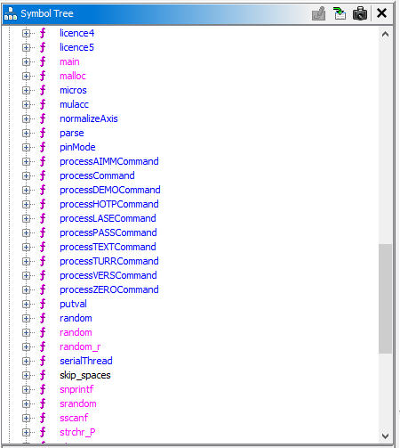
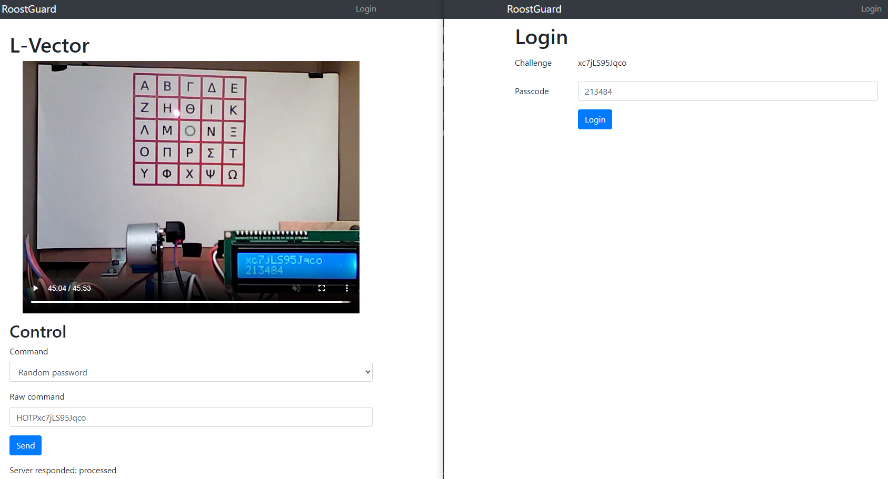
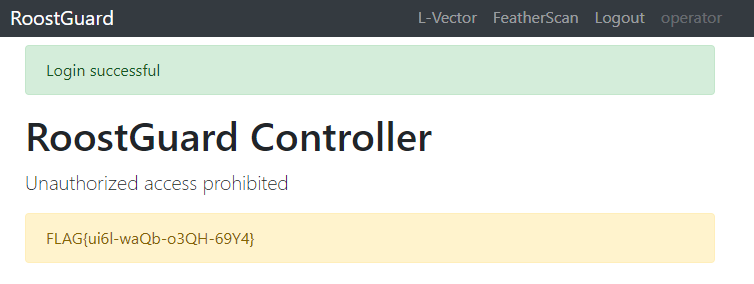

# Zadanie

Hi, emergency troubleshooter,

recent studies suggest that the intense heat and hard labor of solar technicians often trigger strange, vivid dreams about the future of energetics. Over the past few days, technicians have woken up night after night with the same terrifying screams "Look, up in the sky! It’s a bird! It’s a plane! It’s Superman! Let’s roast it anyway!".

Find out what’s going on, we need our technicians to stay sane.

Stay grounded!

- [http://intro.falcon.powergrid.tcc/](http://intro.falcon.powergrid.tcc/)

**Hints**

- Be sure you enter flag for correct chapter.
- In this realm, challenges should be conquered in a precise order, and to triumph over some, you'll need artifacts acquired from others - a unique twist that defies the norms of typical CTF challenges.
- Chapter haiku will lead you.

## Riešenie

Haiku pri tejto úlohe znie

```
3 Open the door

Old lock greets the key,
rusted hinges sing once more—
new paths breathe the fire.
```

Opät nič nehovoriace haiku, ale odkaz opäť vedie na `http://roostguard.falcon.powergrid.tcc/`. Na podstránke operator stále vidím stream s laserovým ukazovátkom na krokových motoroch. Na stránke login je nejaký, zrejme, OTP challenge, ale netuším ako získať passcode pre nejaký konkrétny. Z prvej úlohy viem, že môžem zadať aj nejaké raw commandy, ale neviem aké iné ako tie, čo sú v options v zdrojáku. Ale z druhej úlohy mám firmware `roostguard-firmware-0.9.bin`, tak ho otvorím v ghidre a uvidím, čo ma čaká.

V symbol tree pod funkciami vidím akési funkcie processCommand a processXXXXCommand.



Aktuálne ma najviac zaujal `processHOTPCommand`, ktorý sa mi javí ako najvhodnejší pre vyriešenie tejto úlohy. 

Dal som analyzovať cez Claude s použitím Ghidra MCP a napísal mi toto

```
processHOTPCommand() {
    // 1. Skopíruje challenge z commandBuffer do hotpKeyBuffer (max 20 znakov)
    strncpy(hotpKeyBuffer, commandBuffer, 0x14);

    // 2. Pridá padding (doplnenie) k challenge
    strncpy(hotpKeyBuffer + strlen(hotpKeyBuffer), hotpSecretPadding, 0x10);

    // 3. Vytvorí Key objekt s výsledným kľúčom
    Key::Key(key, hotpKeyBuffer, length);

    // 4. Vytvorí SimpleHOTP objekt s kľúčom a počítadlom
    SimpleHOTP::SimpleHOTP(hotp_instance, key, counter);

    // 5. Vygeneruje HOTP kód
    uint32_t hotp_code = SimpleHOTP::generateHOTP();

    // 6. Zobrazí na LCD a pošle na sériový port
    lcd.clear();
    lcd.print(commandBuffer);  // Zobrazí zadaný challenge
    lcd.setCursor(0, 1);
    lcd.print(hotp_code);       // 6-miestny kód na druhom riadku

    // 7. Odošle odpoveď cez sériový port
    neoSerial.print(">HOTP ");
    neoSerial.print(commandBuffer);
    neoSerial.print(" ");
    neoSerial.println(hotp_code);
}
```

### Ako použiť HOTP príkaz?

#### Formát:

```
HOTP<challenge>
```

**Príklad:**

```
HOTPmychallenge123
```

### Krok za krokom:

1. **Odošli príkaz cez sériovú linku:**
   
   ```
   HOTPmychallenge123
   ```

2. **Zariadenie:**
   
   - Zoberie reťazec `mychallenge123` (bez prefixu "HOTP")
   - Pridá k nemu padding z `hotpSecretPadding`
   - Vygeneruje 6-miestny HOTP kód pomocou HMAC-SHA1
   - Zobrazí kód na LCD displeji

3. **Odpoveď na sériovej linke:**
   
   ```
   >HOTP mychallenge123 123456
   ```

4. **LCD displej zobrazí:**
   
   ```
   Riadok 1: mychallenge123
   Riadok 2: 123456
   ```

Priamy prístup k sériovej linke síce nemám, ale asi k tomu slúži raw_command.



A skutočne to vypísalo passcode pre môj challenge. Kliknem na login a vidím toto



Bingo! 

Na 5b úlohu som čakal niekoľko-krokovú úlohu, ale som šťastný, že mám ďalšiu úlohu hotovú

## Vlajka

    FLAG{ui6l-waQb-o3QH-69Y4}
