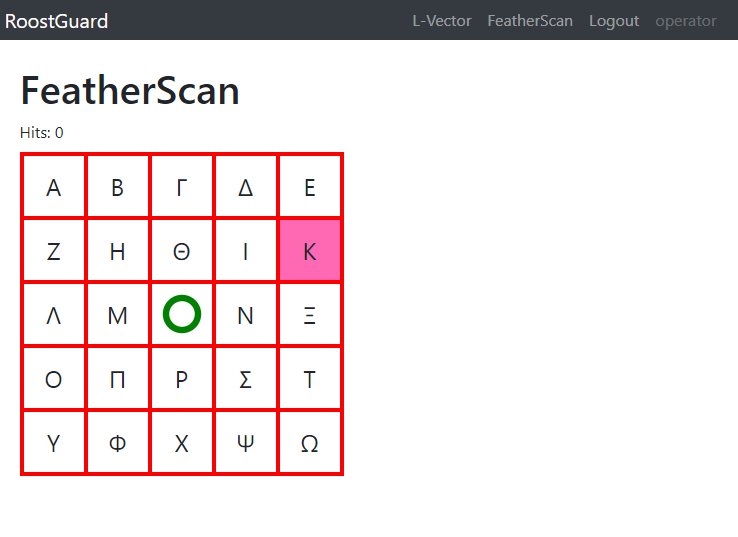
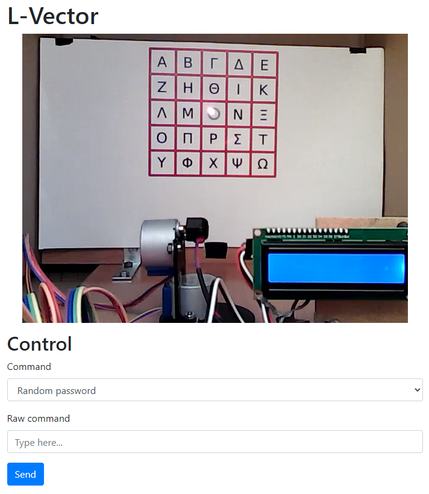
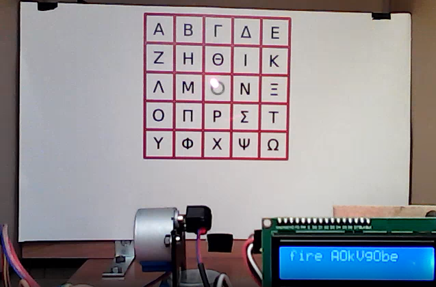
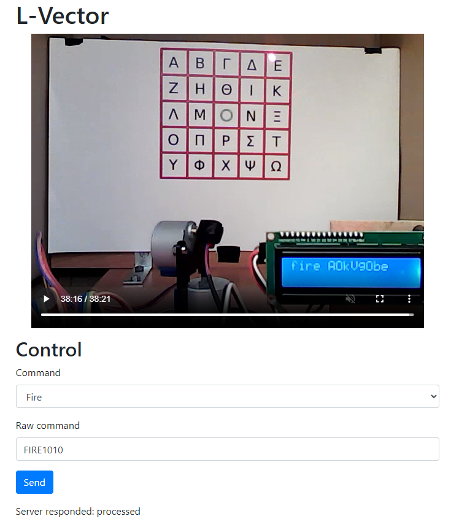
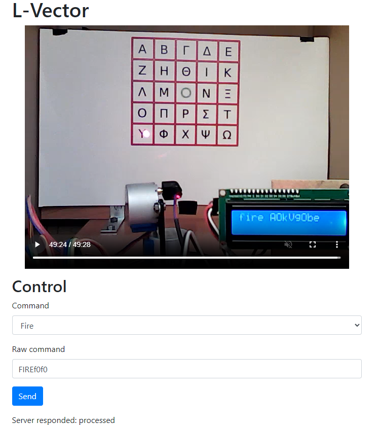
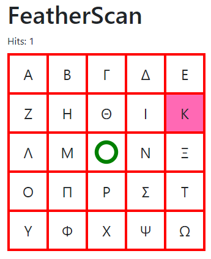
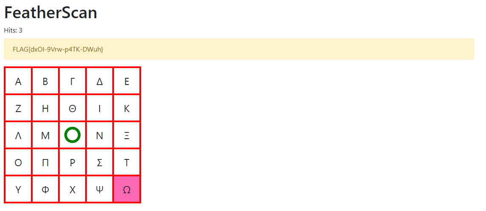

# Zadanie

Hi, emergency troubleshooter,

recent studies suggest that the intense heat and hard labor of solar technicians often trigger strange, vivid dreams about the future of energetics. Over the past few days, technicians have woken up night after night with the same terrifying screams "Look, up in the sky! It’s a bird! It’s a plane! It’s Superman! Let’s roast it anyway!".

Find out what’s going on, we need our technicians to stay sane.

Stay grounded!

- [http://intro.falcon.powergrid.tcc/](http://intro.falcon.powergrid.tcc/)

**Hints**

- Be sure you enter flag for correct chapter.
- In this realm, challenges should be conquered in a precise order, and to triumph over some, you'll need artifacts acquired from others - a unique twist that defies the norms of typical CTF challenges.
- Chapter haiku will lead you.

## Riešenie

Haiku pri tejto úlohe znie

```
5 Hits

Silent shields arise,
code weaving unseen barriers—
guardians without sleep.
```

Tu nás Haiku opäť vedie na `http://roostguard.falcon.powergrid.tcc/`, tentokrát už sme prihlásení a vidíme dve zaujímavé podstránky 

- [L-Vector](http://roostguard.falcon.powergrid.tcc/operator)
- [FeatherScan](http://roostguard.falcon.powergrid.tcc/radar)

L-Vector - tu môžem vybrať jeden z troch commandov 

- Random password (odošle POST 'command=PASS' )

- Firmware version (odošle POST 'command=VERS')

- Fire (odošle POST 'command=FIRE0000')

alebo odoslať Raw command.

FeatherScan ukazuje takúto stránku



Haiku spomína niečo s Hits a tu vidím `Hits: 0`. Ok, zadanie je asi jasné, mám zrejme namieriť laserom na konkrétny symbol na tabuli.



Poslal som teda ten Fire command, odoslalo `command=FIRE0000` a stream ukázal toto



Hitlo stred a zobrazilo `fire A0kVg0be`. Fire command vo firmware nie je, zrejme ide o automatizovanú sériu príkazov, kde sa zrejme vykoná

AIMM0000 - namieri na súradnicu 0x0

LASE1 - zapne ukazovátko

TEXTfire nieco - vypíše text

LASE0 - vypne ukazovátko

DEMOx - pokračuje v DEMO režime.

Po chvíli pátrania som zistil, že to `nieco` za fire je prvých 8 znakov mojich cookies

`session=AOkVgObe3sQMq5LzeyR2APfsgtGk5DX7vk8v9DIQpDU;`, zrejme server dáva feedback, že toto som mieril ja.

Skúsim RAW COMMAND `FIRE1010`



Dobre. takže ma posunulo doprava, nahor. 

AK mám pravdu a posiela sa AIMM command, tak podľa claude to vyzerá takto

### Formát

```
AIMM <x> <y>
```

Kde:

- `x` = horizontálna pozícia (-18 až +18)
- `y` = vertikálna pozícia (-18 až +12)

### Príklady

```
AIMM 00 00    # Stred
AIMM 0A 05    # Vpravo 10°, hore 5°
AIMM F6 FC    # Vľavo 10°, dole 4° (hex signed)
```

FIRE sa však posiela bez medzier, takže web backend to nejako sparsuje a pošle ako potrebuje.. skúsim ísť vľavo dole, takže do záporneho kvadrantu. Ak je to signed hex, tak posielam FIREF0F0... Ale to zamierilo na 0,0. Skúsil som súradnice malým písmom a toto vyšlo..



Kappa (Κ) by zrejme malo trafiť pri príkaze `FIRE1008` a traiflo. mám `Hits: 1`



Ale znovu Kappa, to je lacné. Takže pošlem to isté znovu a mám `Hits: 2`. Tentokrát očakáva Delta(Δ). Opäť kladný/kladný kvadrant. Teraz skúsim poslať `FIRE0810`



Tak a vyhral som vlajku. 

Ešte PoC na Omega(Ω), zadal som `FIRE10f0` a trafilo aj kladný/záporný kvadrant. 

Týmto mám vyriešené a spísané všetko!

## Vlajka

    FLAG{dxOI-9Vrw-p4TK-DWuh}
